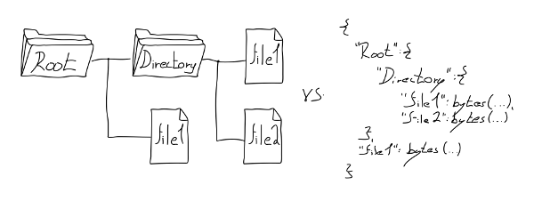

# Programátorova kritika chybějící struktury operačních systémů

2018/12/10

Před nějakou dobou se mi dostalo do rukou [zamyšlení](https://www.cl.cam.ac.uk/~srk31/research/papers/kell13operating.pdf), zdali je vlastně zapotřebí operační systém, či ne. Sám na toto téma provádím jakýsi *„průzkum“* už přibližně dva roky. Rozhodl jsem se tedy, že bych mohl sepsat nosné myšlenky spolu s odkazy na některé relevantní zdroje informací.

## Buďte varováni

Pozor, tento zápisek obsahuje množství textu. Pokud vás text uráží, zvažte, zda se vůbec chcete pustit do diskuze.

## `<možné přeskočit>`

Předně bych rád deklaroval, že tu mluvím sám o sobě. Když budu psát, že *„je něco zapotřebí“*, *„možné“*, nebo *„schůdné“*, myslím tím *„zapotřebí pro mě“*, *„možné pro mě“*, nebo *„schůdné pro mě“*.

Zažil jsem až příliš diskuzí na internetu, které byly způsobeny čtením mezi řádky a vztahováním čtenářovo názorů a předsudků na osobu autora. Vím, že tohle upozornění pravděpodobně nepomůže, ale zkuste se nad prezentovanými myšlenkami zamyslet s otevřenou myslí.

Pokud vám některé moje nápady přijdou kontroverzní, nesmyslné, či pokud budete mít dokonce pocit, že Vás pobuřují svou donebevolající blbostí - uklidněte se. Vzpomeňte si na výše uvedenou deklaraci. Uvědomte si, že vůbec nemluvím o vás, nemám potřebu a chuť vám něco vnucovat, měnit vám workflow, nebo pomlouvat Váš systém. Berte to jako mojí podivnost, jako možný směr, který to chce vyzkoušet a nevztahujte to o čem tu mluvím na sebe.

Jestliže v článku i poté uvidíte nedostatky a napadne Vás něco konstruktivního k věci, napište to do diskuze. Zkusme to tu pro jednou udržet v konstruktivní rovině.

## Poznámka k časovému rozpětí diskuze

Neušlo mé pozornosti, že diskuze pod většinou článků na abclinuxu trvá maximálně několik týdnů, v řídkých případech jednotky měsíců.

Jsem si vědom, že abclinuxu zobrazuje u starších článků upozornění na dlouhou dobu od vydání článku a nepovažuji to za správný nápad. Pokud máte co konstruktivního říct a přečtete si tenhle článek třeba desetiletí po jeho vydání, já jako autor stále stojím o váš názor.

Pokud ho nechcete, či nemůžete vložit do diskuze, pošlete mi ho emailem na `bystrousak[]kitakitsune.org`, s nějakým smysluplným předmětem. Možná Vás to překvapí, ale napsal jsem docela hodně článků s podobným upozorněním a dodneška diskutuji s lidmi co je četli, i když je to třeba 7 let od vydání. O váš názor stojím.

Osobně ovšem preferuji diskuzi zde pod článkem, neboť z ní mohou těžit i ostatní. Taky to trochu zabraňuje neustálému opakování otázek.

## `</možné přeskočit>`

## Proč?

V posledních letech jsem pracoval pro několik firem vytvářejících software. V některých případech jsem se zapojil do již existujících týmů, v ostatních jsem začínal spolu s několika dalšími programátory „na zelené louce“. Často jsem se přímo podílel na návrhu architektury, pokud jsem jí rovnou nevymýšlel sám.

Pracuji jako *„backendový programátor“*. Mým popisem práce je typicky vytvářet systémy, které načítají, zpracovávají a ukládají různá data, parsují všemožné formáty, volají různé programy, či interagují s ostatními systémy a zařízeními.

V *Národní knihovně* jsem v tříčlenném týmu dělal na systému pro zpracování elektronických publikací. Vytvořil jsem tam prakticky veškerý backendový kód, od ukládání dat, po komunikaci s ostatními systémy, mezi které patří například Aleph, Kramerius, nebo LTP (dlouhodobý archiv digitálních dat). Pro ukládání byl použit linuxový filesystém ext4 na CentOSu a objektová databáze [ZODB](https://en.wikipedia.org/wiki/Zope_Object_Database) vynucená [Plonem](https://plone.org/), ve kterém byla frontendová část. Pro komunikaci pak všechno možné, od volání API přes [REST](https://www.zdrojak.cz/clanky/rest-architektura-pro-webove-api/), nahrávání XML souborů na FTP, balení věcí do ZIPu az po kopírování na sambu. Interní komponenty mezi sebou používaly [RabbitMQ](https://en.wikipedia.org/wiki/RabbitMQ).

V jisté nejmenované společnosti jsem pracoval na systému k ochraně proti DDoS útokům. Kvůli NDA nemůžu rozebírat podrobnosti nad rámec popisu tehdejších pracovních inzerátů. Ty ukazují, že byl také použit linux, python, SQL i NoSQL databáze, spousta různých existujících opensource programů a na komunikaci RabbitMQ. Na velké části z toho komunikačního kódu jsem dělal přímo já.

Pro *Nubium development*, vytvářející asi nejznámější český filehostingový web *ulož.to*, jsem dělal na backendu. Zrefaktoroval jsem a částečně navrhl kusy software, které se starají o ukládání a redistribuci souborů napříč různými servery, ale i o zpracování uživatelských dat. Například ikonky, které se zobrazují u náhledů archivů a videí, jsou moje práce, kromě spousty dalších věcí, které nikde neuvidíte.

Pro pár dalších firem jsem dělal různé weby a RESTové služby. Sáhl jsem si ovšem i na exotičtější věcí, například na systém pro rozpoznání a automatické vyhodnocování záběrů z kamer v různých tunelech a k tomu přidružený *machine learning*.

Všude kde jsem dělal se používal linux, databáze, a většinou i nějaká forma *message queue* předávající strukturovaná data. Někdy šlo o SQL tabulky, jindy o JSON poslaný přes RabbitMQ.

V každé z jmenovaných firem jsem viděl ten samý vzor - nezávisle na sobě vytvořený, přibližně podobný kus software, který přirozeně vyplynul z několika požadavků:

- Spolehlivé ukládání velkého počtu malých souborů (miliony souborů, s průměrně megabajty až gigabajty na soubor), či menšího počtu velkých souborů (terabajty / soubor).
- Načítání a zápis konfigurace ve strukturovaném formátu (INI, JSON, XML, YAML, ..).
- Strukturovaná komunikace mezi vlastními, ale i s cizími programy.
- Distribuovaná architektura zahrnující vícero fyzických strojů, umožňující snadné škálování.

Pokud programujete, pravděpodobně víte, kam tím mířím. Jestliže spousta programátorů vytváří nad danou knihovnou stále stejný vzor, nejedná se o chybu programátorů, ale o špatně navrženou knihovnu.

Postupně, jak jsem nad tím tak přemýšlel, jsem dospěl k názoru, že je špatně samotná *architektura* operačního systému. To co nám nabízí a co umožňuje nepovídá tomu co po něm chceme a co od něj očekáváme. Především z hlediska „*programátorského uživatelského interface*“, tedy toho, s čím jako programátor pracuji.

## Operační systém

Když jsem byl mladší, měl jsem poměrně jasnou představu o tom, co je to operační systém: *Windows přece*. To je ta věc, co mají všichni na počítači, vlevo dole to má tlačítko start, a když nenaběhne a zobrazí se jen černá obrazovka, je zapotřebí napsat `win`.

Na střední škole mě naučili definici, podle které je operační systém *„programové vybavení počítače zpřístupňující vstupně-výstupní zařízení“*.

Později jsem zjistil, že operačních systémů existuje hodně a v podstatě všechny dělají to samé; vytvářejí ± jednotnou abstrakci nad hardwarem počítače, umožňují pouštět různé programy, nabízí více, či méně propracovaný filesystém, spravují paměť, řeší multitasking a uživatelská práva.

V dnešní době je operační systém pro většinu lidí *to*, čím pouští své prohlížeče, ve kterých koukají na *youtuby* a na *facebooky* a taky skrz *to* posílají emaily. Občas *to* umí pouštět hry a pracovat se vším možným, od CD-ROMky po klávesnici.

Pro pokročilé uživatele je to pak určitá forma databáze a API, která umožňuje spouštět jejich programy a také nabízí standardizovaný přístup ke konkrétním činnostem. Například výpis znaku, uložení souboru, navázání spojení po internetu a tak podobně.

Většinou máme tendenci vnímat operační systém jako něco neměnného, co si vybereme z relativně malé nabídky diktováné svatou trojicí (Windows, Mac, Linux), okolo které se zmateně krčí několik prakticky nepoužívaných (0.03% celkem) alternativ (*BSD, Plan9, BeOS, ..).

Z nějakého důvodu jsou všechny skutečně používané systémy až na výjimky hodně podobné. Rád bych se zamyslel, jestli je to skutečně žádaná vlastnost, nebo náhodný historický vývoj.

## Krátká historie operačních systémů

První počítače neměly operační systém a byly uživatelsky velmi nepříjemné. Daly se programovat pouze přímou změnou hardwarového propojení.

Pak přišly děrnoštítkové a děrnopáskové stroje. Na nich operátor [nacvakal](https://youtu.be/XV-7J5y1TQc?t=242) sérií přepínačů přímo do paměti binárně „zavaděč“, jenž mu umožnil načíst děrné štítky, či děrný pásek. Ten obsahoval sekvence instrukcí a data.

Systém pracoval v takzvaných dávkách. Programátor dodal médium s dávkou dat, operátor je načetl do počítače a spustil. Po dokončení běhu vrátil programátorovi výsledky, či chybovou hlášku, pokud došlo k chybě.

Jelikož se jednalo o hodně manuální činnosti, časem vznikly knihovny pomocných funkcí a různé užitečné nástroje. Například zavaděč, který se zavede automaticky po startu počítače a umožní načtení programátorova programu pouhým stisknutím patřičného tlačítka. Nebo *subrutina*, která při pádu programu vypíše obsah paměti. Těmto programům se říkalo *monitory*.

Protože tehdejší počítače byly velmi, velmi drahé, vznikl tlak na jejich použití vícero uživateli zároveň. S tím přišly první operační systémy, které sloučily funkcionalitu *monitoru*, přidaly podporu běhu vícero programů zároveň a také nabídly správu a paralelní přístup vícero uživatelů.

Stále komplikovanější hardware a komplexita jeho přímého ovládání způsobila narůstající tlak na univerzálnost kódu mezi různými stroji a jejich verzemi. Operační systémy začaly nabízet podporu typicky používaných zařízení. Nadále již nebylo třeba zadávat adresu paměti na disku, stačilo uložit data do pojmenovaného umístění, a později i do složek. Vznikly první souborové systémy. S podporou vícero uživatelů zároveň vyvstala také snaha oddělit jejich programy, aby si navzájem nemohly přepisovat a číst data. Také vznikly plánovače a virtuální paměť a multitasking.

Operační systémy se staly vrstvou, která stojí mezi uživatelem, jenž nadále nemusí být programátorem, a poskytuje mu standardní způsoby uložení dat, výpisu znaku na obrazovku, práci s klávesnicí, tisku na tiskárnu a spuštění jeho dávky / programu.

Později k tomu přibylo ještě grafické rozhraní a síťování. Osobní počítače nabídly plejádu zařízení, z nichž všechny musel operační systém umět používat a podporovat. Až na pár výjimek, kterým se budu věnovat dále, šlo o iterativní vývoj, který nepřinesl nic zásadně revolučního. Všechno se zlepšovalo, zefektivňovalo, samotné paradigma se však moc nezměnilo.

# Kritika operačního systému

Nemám nejmenší problém s konceptem operačního systému jako hardwarové abstrakce. Naopak! Mám problém s konceptem OS jako uživatelského rozhraní. Tím nemyslím grafiku, ale zbytek všeho s čím interagujete, a co má nějaký tvar;

## Koncept souborového systému

Schválně se zkuste zamyslet, co to vlastně je. Vyjde vám, že je to omezená hierarchická *key-value* databáze.

Omezená, protože omezuje nejen velikost a subset klíče, který je v lepším případě v UTF, ale i samotnou uloženou *hodnotu* na proud bajtů. To se zdá rozumné jen do chvíle, kdy si uvědomíte, že je to stromová databáze, která vám nedovoluje přímo ukládat strukturovaná data. Počet inodů (větví struktury) je navíc omezen na číslo, jenž se v horších případech pohybuje v řádu desítek až stovek tisíc, maximálně však pár milionů prvků v jednom *adresáři*.

Ve dvou z mých předchozích zaměstnáních jsme museli obcházet omezený počet inodů na složku retardací jako [BalancedDiscStorage](http://balanceddiscstorage.readthedocs.io/), či ukládáním souborů do tří podsložek složených z prvních tří písmen MD5 hashe souboru.

K tomu pro většinu operací chybí atomicita, a transakce nejsou podporovány vůbec. Paralelní zápisy a čtení fungují v různých operačních systémech různě, a ve skutečnosti není garantováno naprosto nic. Schválně si to srovnejte se světem databází, kde se [ACID](https://cs.wikipedia.org/wiki/Datab%C3%A1zov%C3%A1_transakce#Vlastnosti) považuje za samozřejmost.

Filesystém je specificky omezená databáze. Každý koho znám, kdo se kdy pokusil filesystém použít pro cokoliv netriviálního, dřív nebo později tvrdě narazil. Ať už je to programátor, který si řekne, že si ty data prostě a jednoduše bude ukládat do souborů, nebo uživatel, který se v bordelu na filesystému nemůže vyznat a musí používat různé divné vyhledávání a indexování. Výkřikem techniky je, když dokáže poznat, že má poškozená data a dopočítat je zpětně ze samo-opravných kódů, pokud máte disky v RAIDu.

Samozřejmě chápu, že pointou je něco jiného. Řeší se tu sektory na disku a žurnálování, plotny a oddíly a RAIDy a celé je to super pokrok oproti původním primitivním systémům ukládání dat. *Ale* — není to náhodou pokrok špatným směrem?

Původní filesystémy byly metafora. Metafora pro ukládání souborů do složek, tak jako se strkají papíry do šanonů a šuplíků. Kromě mnoha technických omezení, daných stavem tehdejší výpočetní techniky, trpěly a trpí i omezením z podstaty této metafory. Přemýšlím, jestli by jsme si místo otázky *„jak trochu vylepšit padesát let starou metaforu“* (třeba pomocí tagů) neměli klást spíš otázku *„je to vážně ta správná metafora pro ukládání dat?“*

## Programy

Čistě fyzicky, programy jako takové nejsou nic jiného, než jen sekvence uložených bajtů. V podstatě ani pro operační systém nemůžou být nic jiného, neboť souborová databáze operačního systému s ničím jiným pracovat ani neumí.

Programy se prvně napíšou ve zdrojovém kódu příslušného jazyka, který se potom zkompiluje a slinkuje do jednoho bloku. Ten je následně vyděrován na děrné štítky (binární data) a zastrčen do patřičné krabice (souboru) ve správné sekci kartotéky (filesystému).

Když chce uživatel program pustit, napíše jeho jméno na příkazovém řádku, nebo někde klepne na ikonu. Poskládané děrné štítky jsou následně vyndány z kartotéky a nacpány do paměti, která se pro program tváří, jako kdyby byl v celém operačním systému sám. Kód je poté prováděn od počátečních děrných štítků k těm koncovým, s tím že program může podmíněně přeskočit na konkrétní děrný štítek v krabici, která ho tvoří.

Programy taky můžou číst parametry příkazového řádku, používat sdílené knihovny, volat API operačního systému, pracovat s filesystémem, posílat (číselné) signály různým jiným programům, reagovat na ně, vracet návratové hodnoty, nebo otevírat sockety.

Co je na tom špatně?

Nechci říct, že je koncept špatný jako takový. ALE. Opět je to stejná stará metafora, iterativním vývojem posunutá o pár kroků dál. Všechno mi přijde hrozně *nízkoúrovňové*. Celý ten systém se za posledních 40 let změnil jen minimálně a nemůžu se zbavit myšlenky, že než že by jsme dorazili k naprosté dokonalosti, spíš jsme někde uvázli v zákrutě lokálního maxima.

[Lispovské stroje](https://en.wikipedia.org/wiki/Lisp_machine), [Smalltalkovské](http://toastytech.com/guis/alto3.html) a [Selfové prostředí](http://www.selflanguage.org/) mě naučily, že se to dá dělat i jinak. Že programy nutně nemusí být kolekce bajtů, ale můžou to být malé samostatné objekty, které jsou (metaforou posílání zpráv) zavolatelné z ostatních částí systému, a které se dynamicky kompilují podle potřeby.

Znáte takovou tu [unixovou filosofii](https://cs.wikipedia.org/wiki/Filosofie_Unixu), že je dobré používat malé programy, které dělají jednu věc, na tu se zaměřují a dělají jí dobře? Proč tu myšlenku nedotáhnout do konce a neudělat malé programy z každé funkce a metody vašeho programu? Ta by naoplátku mohla komunikovat s metodami a funkcemi ostatních programů.

Ve Smalltalku to tak funguje, dokonce není problém to verzovat, specifikovat závislosti, mít nad tím package manager, ošetření chyb, nápovědu a kdo ví co dalšího. Vážně by to nešlo dělat s programy obecně?

## Data bez struktury, nazývaná soubory

> The whole UNIX ethos has been a huge drag on industry progress. UNIX's pitch is essentially: how about a system of small functions each doing discrete individual things... but functions must all have the signature char *function(const char *)? Structured data is for fools, we'll just reductively do everything as text. What we had in 1972 is fine. Let's stick with that.

*(Idroj: [http://www.righto.com/2017/10/the-xerox-alto-smalltalk-and-rewriting.html?showComment=1508781022450#c7613952874348706529](http://www.righto.com/2017/10/the-xerox-alto-smalltalk-and-rewriting.html?showComment=1508781022450#c7613952874348706529))*

A jsme zase u těch binárních dat. Na první pohled geniální myšlenka, protože nic nemůže být víc univerzální. Na další pohled už tak ne.

V čem je problém?

Prakticky všechna data mají svou strukturu. Kdykoliv, kdy programátoři v programovacím jazyku pracují s daty, a nejedná se jen o jejich přesunutí, tak se jim snaží dát strukturu. Namapují je na různé `struct` konstrukty. Vytvoří z nich strom objektů. I u *streamovaných* věcí, jako je třeba záznam zvuku ve formátu [WAV](https://cs.wikipedia.org/wiki/WAV), se iteruje skrz jednotlivé *chunky*.

*(Struktura WAV souboru. Zdroj: [https://github.com/corkami/pics/](https://github.com/corkami/pics/).)*

Proč tedy proboha každý program vezme data, dá jim strukturu, něco nad ní udělá a tu strukturu zahodí a zkolabuje zpět na nestrukturovaná, *surová* binární data?

Současná počítačová kultura je posedlá parsery a externími popisy dat, jenž by však mohly nést strukturu samy o sobě. Každý den jsou nesmírná kvanta výpočetních cyklů zcela nesmyslně plýtvána na konverzi *surových* bajtů na struktury a zase zpět. A každý program to dělá jinak, dokonce i v různých verzích. Nemalá část mé práce jako programátora je jen o parsování a převodech dat, jenž kdyby měla strukturu, tak by byla upravitelná jednoduchou transformací. Tady vem kus stromu a přesuň ho sem. K téhle části grafu přidej tohle, jinde něco uber.

Současná situace je analogická k situaci, kde kdybych posílal poštou hrad z lega, tak bych ho rozložil na jednotlivé kostky a k balíku přibalil referenci na návod, jak si hrad složit. Příjemce by si pak návod musel *někde* sehnat a hrad pracně skládat. Absurdita je zřejmější, když si uvědomíme, že se to netýká jen kostek lega, ale úplně všeho. I kdybych chtěl někomu podat sklenici, tak bych jí podal jako hrst písku a příjemce by si musel sklenici vyrobit sám. Je mi jasné, že na konci se vždy musí posílat bajty, stejně jako se musí posílat kostky lega. Ale proč je neposlat už složené?

Nejde jen o nesmyslnost toho všeho. Jde o to, že zároveň s tím je to i *horší*. Horší pro uživatele, a horší pro programátory. Data se kterými pracujete by mohla být sebe-popisná, ale nejsou. Jednotlivé položky by mohly obsahovat datové typy, ale i dokumentaci. A nemají. Proč? Protože je v módě mít zvlášť hromadu binárních dat, a zvlášť jejich externí popis. Vážně to tak chceme, vážně to má nějaké výhody?

V minulém desetiletí bylo možné vidět masivní nárůst používání formátů jako XML, JSON a YAML. Určitě lepší než drátem do oka, ale to stále není to o čem tu mluvím. Nejde mi o konkrétní formát, jde mi o strukturu samotnou. Proč nemít strukturovaně všechna data?

Nemluvím tady o parsování XML parserem, mluvím tu o přímém načtení do paměti, ve stylu [message packu](https://msgpack.org/), [SBE](https://github.com/real-logic/simple-binary-encoding), nebo [FlatBuffers](https://google.github.io/flatbuffers/), či [Cap’n Proto](https://capnproto.org/). Bez toho aniž by bylo třeba vyhodnocovat text a řešit escape sekvence a formát unicode. O tom že na strukturovaná data o *Frantovi Putšálkovi* v kolekci lidí přistoupím pomocí `people[0].name`, místo toho abych v jednom formátu dělal `doc.getElementByTagName("person")[0].name.value` a v druhém `doc["people"][0]["name"]`. O tom že si můžu k atributu přečíst nápovědu pouhým `help(people)`, místo abych hledal dokumentaci.

Mluvím tu o tom že se neparsuji s WAVem, ale prostě iteruji přes jednotlivé *chunky*, které tam jsou. O tom že data popisují sebe sama přímo svou strukturou, ne externím popisem. Mluvím o přímé serializaci objektů, o jednotném systému podporovaném všemi jazyky, i když nemají objekty.

Vážně by to bylo tak nemožné? Proč?

## Strukturovaná komunikace

Všímáte si toho vzoru v mé kritice, hněvu a vášni? Je jím téma *neuvědomělé struktury*.

Souborové systémy nevnímáme jako databáze. Nedochází nám, že jejich struktura jsou hierarchická *key-value* data. Programy bereme jako binární bloby, místo klubka propojených funkcí a struktur a objektů majících potřebu komunikovat se sebou, ale i s okolním světem. Data chápeme jako mrtvé série surových bajtů, místo stromových a grafových struktur.

Co dalšího má strukturu, o čem jsem zatím nepsal? Samozřejmě komunikace. S operačním systémem. S programy. Mezi programy.

## /sys

[Plan9](https://en.wikipedia.org/wiki/Plan_9_from_Bell_Labs) byl úžasným krokem tímhle směrem. Poté co jsem ho prozkoumal jsem však dospěl k názoru, že tvůrci sice měli obecné povědomí o tom co dělají, ale nedošlo jim to v celé úplnosti. Možná částečně proto, že byli stále hodně ovlivněni unixem a komunikací v proudech bajtů.

Na Plan9 je úžasné, jak můžete interagovat se systémem pomocí zápisu a čtení z různých speciálních souborů. Fantastické! Revoluční! Tak úžasné, že to linux převzal například v podobě `/sys` subsystému a [FUSE](https://cs.wikipedia.org/wiki/Filesystem_in_Userspace).

Víte co tomu chybí? Reflexe a struktura. Pokud si nepřečtete manuál, tak naprosto netušíte co kam zapsat.

Zde je kód pro blikání diodou na raspberry pi:

    echo 27 > /sys/class/gpio/export
    echo out > /sys/class/gpio/export/gpio27/direction
    echo 1 > /sys/class/gpio/export/gpio27/value

Jak jsou řešeny chyby? Co když do `/sys/class/gpio/export/gpio27/value` zapíšu string „vánočka“? Dostanu zpět error kód z echa? Nebo se v nějakém jiném souboru něco objeví? Jak jsou zvládány paralelní zápisy? A co čtení, kde je popsáno co můžu dostat za hodnoty, když do `/sys/class/gpio/export/gpio27/direction` zapíšu `„in“` místo `„out“`?

Prostě jak si to který modul udělá, tak to bude. Datové typy se neřeší. Pojďme postavit komunikaci se systémem na databázi, která si neuvědomuje že je databáze!

Tohle je asi největší neuvědomělá snaha o zavedení čehosi jako objektů, jakou jsem kdy viděl. Ta struktura jsou objekty. Jen ten rozdíl mezi `sys.class.gpio.diode` a složkou na podobném umístění je že složka je nepopsaná *key-value* položka, podobně jako JSON, která nemá jasně dané properties, formát dat, nápovědu, nebo třeba formát a způsob vyvolávání výjimek.

## Sockety

Já chápu, proč vznikly. Vážně. Ve své době to bylo naprosto racionální a nebylo nic lepšího. Ale proč proboha používat nestrukturovaný formát přenosu binárních dat i dneska, když veškerá komunikace je strukturovaná, což platí i pro zdánlivé proudy bajtů, jako streamované audio.

Vemte si, jak to vypadá, když píšete IRC bota. Navážete spojení. Super. Samozřejmě použijete `select`, aby jste nevytěžovali procesor. Data čtete v blocích, například 4096 bajtů. V paměti je převádíte na stringy a hledáte v nich nové „`\r\n“`. Musíte bufferovat a zpracovávat řádky vždy až když dorazí celé. Pak parsujete textovou strukturu a skládáte z ní zprávy o jednom řádku. A různé zprávy mají různé formáty a je třeba je parsovat různě. Hrozná zábava s reimplementací [specifikace](https://tools.ietf.org/html/rfc1459) po milionté jinak. Přitom zprávy by mohly mít strukturu samy o sobě, stejnou jako zbytek všeho ostatního.

Nebo třeba HTTP. To přece přenáší strukturovaná HTML data, ne? Máte jasně daný jazyk a jeho popis a způsob parsování. Super! Co víc si přát. Myslíte ale, že HTTP používá na úrovni přenosového protokolu jako datový formát (HT/X)ML? Ani náhodou, samozřejmě, že si specifikuje vlastní protokol, který [vypadá](https://cs.wikipedia.org/wiki/Hypertext_Transfer_Protocol) úplně jinak (*key-value* data hlaviček a pak způsob posílání *chunků* dat).

Email? Ani mě nenechte začít na téma zkaženosti emailu, jeho protokolu a formátu, kde se nejasně definovaná struktura v asi pěti standardech mísí mezi sebou a každý výrobce si to implementuje po svém. Pokud jste někdy zkoušeli zpracovávat emailové hlavičky z nějaké konference, tak určitě víte. Pokud ne, zkuste si to. Garantuji, že vám to změní pohled na svět.

A tak je to se vším. Skoro nikdy nepotřebujete proud bajtů, ale posílat zprávy, které jsou prakticky vždy hierarchie *key-val* dat, nebo pole. Proč tedy skoro 50 let po vynálezu socketu stále přenášíme data ve streamech a neustále si vymýšlíme vlastní textové protokoly? Není čas na něco lepšího?

Vytvoříme strukturu tady, pak jí serializujeme na surové bajty, nacpeme do socketu a pošleme systému, který musí provést deserializaci a rekonstrukci na základě externího popisu dat, který je s trochou štěstí podobný tomu našemu. Proč? Proč neposílat rovnou struktury?

[ZeroMQ](https://en.wikipedia.org/wiki/ZeroMQ) byla podle mého názoru krok správným směrem, ale zatím mi přijde, že se nedočkala moc vřelého přijetí.

## Parametry příkazové řádky

Máte program na disku, který něco dělá. Když vynechám kliknutí a následné „ruční“ zadání dat, tak argumenty příkazové řádky jsou jeden z nejčastějších způsobů, jak programu říct, co po něm chcete. A každý druhý program si je parsuje vlastním způsobem.

Reálně neexistuje žádný standard formátu argumentů na příkazové řádce. Některé programy používají `--param`. Jiné `-param`. Další jen `param`. Někdy se seznamy oddělují mezerami, jindy čárkami. Už jsem dokonce zažil i JSON parametry mixované s těmi normálními.

Pokud program voláte z nějakého příkazového řádku, tak se vám do toho navíc mixuje jeho scriptovací jazyk a jeho způsob definice stringů, proměnných a bůh ví čeho dalšího (z hlavy mě napadají escape sekvence, jména funkcí, eval sekvence, wildcards znaky, `--` pro ukončení wildcardů a tak podobně). Celé je to jeden velký, gigantický bordel, který si každý patlá a parsuje, jak se mu zrovna chce.

A co volání ostatních programů z *jiných programů*? Ani nechci vzpomínat, kolikrát jsem viděl, či psal kód ve stylu:

    import subprocess
    
    sp = subprocess.Popen(
      ['7z', 'a', 'Test.7z', 'Test', '-mx9'],
      stderr=subprocess.STDOUT,
      stdout=subprocess.PIPE
    )
    stdout, stderr = sp.communicate()

Naposledy nedávno, i s celou plejádou parsování free-form výstupu. A už mě to vážně nebaví.

Pokud jsou argumenty složitější, stane se z toho rychle onanie skládání stringů, kde si navíc nemůžete být jisti bezpečností, nemáte garanci podporované znakové sady, musíte sanitizovat uživatelský vstup a volané podprogramy navíc stále můžou vykazovat chování, které je všechno, jen ne triviální. Například vám [zatuhne buffer](https://thraxil.org/users/anders/posts/2008/03/13/Subprocess-Hanging-PIPE-is-your-enemy/) při větším výstupu. Nebo program reaguje jinak v neinteraktivním režimu, než v interaktivním a není žádný způsob, jak ho přesvědčit o opaku. Případně vám cpe escape sekvence a `tty` formátování, kam by jste nechtěli. A jak asi přenesete strukturovaná data tam a zpět?

Přitom parametry příkazové řádky jsou většinou nějakým seznamem, nebo slovníkem s vnořenými strukturami. Chce to jednotný a na zápis jednoduchý jazyk. Něco lehčího na zápis, než JSON, ale zároveň víc expresivního.

Úplně pak vynechávám, že nutnost parametrů příkazové řádky se úplně vytratí, když můžete posílat programu strukturované zprávy podobně jako volat funkci v programovacím jazyku. Vždyť nejde o nic jiného, než o zavolání patřičné funkce / metody s konkrétními parametry, tak proč to dělat takhle divně a nepřímo?

## Env proměnné

*Env* proměnné jsou slovník. Doslova se tak mapují a chovají. Jenže díky *chybějící struktuře* jsou jen jednorozměrným slovníkem s klíči a hodnotami v podobě stringů. V D by se zapsaly jako `string[string] env;`. To často nestačí, protože potřebujete přenést vnořené struktury.

Má duše křičí, terorizována hláškami jako „*potřebuješ předat složitější data do* `env` *proměnné? tak tam zapiš JSON, nebo odkaz na soubor!*“ Proč proboha jako civilizace nezvládneme jednotný způsob předávání a ukládání dat, že musíme míchat syntaxi `env` proměnných v bashi s JSONem?

## Konfigurační soubory

Ať už si to uvědomujete, nebo ne, prakticky každý netriviální program ve vašem počítači potřebuje nějakou konfiguraci. Tu si zpravidla bere z konfiguračního souboru. Víte, kde je ten soubor umístěný? V Linuxu bývá standardem je umisťovat do `/etc`, ale klidně můžou být taky ve vašem `$HOME`, nebo v `$HOME/.config`, nebo v libovolné podsložce (třeba `$HOME/.thunderbird/`).

A co formát? Hádáte správně. Může být libovolný; *(pseudo)*INI, XML, JSON, YAML. Nebo Lua. Nebo taky hybrid vlastního programovacího jazyka (viz postfix). Co koho zrovna napadne, to se používá.

Existuje vtip, že komplexita každého konfiguračního souborů s časem roste, dokud v něm někdo vytvoří špatně implementovanou půlku lispu. Mým oblíbeným příkladem je [Ansible](https://www.ansible.com/) a jeho nedotažená, nekompletní parodie na [programovací jazyk postavený nad YAMLem](http://docs.ansible.com/ansible/latest/playbooks_conditionals.html).

Chápu, kde se to bere. Taky jsem touhle cestou šel. Proč to ale nemůže být standardizované a stejné napříč celým systémem? Ideálně ten samý datový formát, který je zároveň jazykem, napříč vším. Proč nemůžou být konfigurací samotné objekty uložené v patřičném umístění?

## Logy

U logování je typicky nutno řešit následující problémy:

1. Strukturované logování. Ukládání ve formátu, jenž je možné následně zpracovávat, provádět nad ním dotazy a tak podobně.
2. Paralelní přístup, aby mohlo logovat vícero aplikací do jednoho logu a jednotlivé záznamy se „nekřížily“.
3. Rotování logů. Staré logy se postupně přejmenovávávají, jsou komprimovány a po čase úplně smazány.
4. Způsob logování. Aplikace musí logy nějak dopravit do cílového úložiště.

Současná řešení jsou opět typicky zcela různá, tak jak koho zrovna co napadlo:

1. Struktura logů je nahodilá. Prakticky všichni používají nějaký více/méně parsovatelný formát, ale jeho tvar je často různý. Málokdy je definováno například jak jsou uloženy a „escapovány“ víceřádkové logy. Parsování probíhá ve velké části přes regexpy a prakticky vždy je křehké a rozbitelné. S určitou pýchou vždy ukazuji kolegům že jejich logy dokážu rozbít obejitím jejich regexpu a snažím se je přesvědčit o použití něčeho nerozbitného.
2. Paralelní logování je řešeno separátní logovací aplikací. Filesystém, na rozdíl od většiny ostatních databází, neumí atomický přístup, ani nic jako triggery, takže pokud tahle aplikace spadne, je po lozích.
3. Rotování je také řešeno externí aplikací, a prakticky vždycky se jedná o záležitost periodicky pouštěnou *cronem*. Ještě jsem neviděl chytré logování, které by zvládlo odrotovat log, když hrozí, že na disku kvůli němu nezbude místo, zato jsem viděl pár služeb v produkci, jenž to položilo. Další problém je, že aplikace typicky mají otevřený soubor s logem a pokud je jim „odrotován“ pod rukama, tak se to celé rozbije. Řeší se to naprosto ne-elegantně posíláním signálů, na které musí umět asynchronně reagovat. Nedávno jsem se hrozně vysmál, když kolega chtěl logovat jen na *stdout* a tak změnil cestu k souborovému logu na `/dev/null`. Celé to krásně fungovalo jen do té doby, než se pythonní [RotatingFileHandler](https://docs.python.org/3/library/logging.handlers.html#rotatingfilehandler) rozhodl soubor odrotovat a celá aplikace spadla.
4. Co se způsobu týče, tak některé aplikace prostě otevřou soubor a logují do něj. Jiné posílají data na UDP (syslog). Další zas posílají zprávy v JSONu do Sentry. Co koho napadne a co je zrovna populární, tak to bude.

Logování mi přijde jako krásná ukázka programátorské struktury, kterou je nucen řešit prakticky každý a kterou operační systém v celé komplexitě podporuje skoro vůbec, nebo jen málo. Je to také krásná ukázka konceptu, který by si zasloužil převést na posílání strukturovaných zpráv;

Zprávy jsou objeky. Mají své datum odeslání, mají krátký text a většinou i dlouhý text a také „úroveň“ (v pythonu typicky `DEBUG`, `INFO`, `WARNING`, `ERROR`). Pokud s logy pracujete, skoro nikdy nechcete pracovat na úrovni textu. Chcete například omezit datum - jak to uděláte, když se jedná o text? Nebo úroveň - pokud chcete všechny zprávy úrovně `ERROR`, nechcete to *grepovat* textově, protože slovo „ERROR“ může být použito i v tělě zprávy v různých kontextech. Například „NO_ERROR“.

Aplikace, do které se loguje by měla přijímat zprávy, které bude uchovávat v datové struktuře [fronta](https://cs.wikipedia.org/wiki/Fronta_(datov%C3%A1_struktura)). Tím by nikdy nemohlo dojít místo na disku. Starší struktury by bylo možné automaticky komprimovat, ale pro uživatele by to mělo být transparentní - pokud chce vyhledávat nad komprimovanými zprávami, ani by o tom neměl vědět.

Nemělo by existovat padesát způsobů logování - pro uživatele by to měla být záležitost instancování systémového loggeru a jeho následné používání, po krátké konfiguraci, kde si zvolí politiku rotace. Pak už jen loguje standardním posláním zprávy, ať už lokálně, nebo vzdáleně z internetu.

# Ukázková studie: Docker

[Docker](https://en.wikipedia.org/wiki/Docker_(software)) je virtualizační nástroj umožňující vám sestavovat, spravovat a spouštět kontejnery virtuálních počítačů, ve kterých je specifické programové vybavení.

Osobně mám Docker docela rád a občas ho používám k sestavování balíčků pro cílové distribuce (například `.deb` pro Debian a `.rpm` pro RHEL).

Parametrů Dockeru je nepřeberně: [https://docs.docker.com/engine/reference/run/](https://docs.docker.com/engine/reference/run/). Mojí oblíbenou částí jsou volumes, tedy složky, jenž jsou mountovány dovnitř kontejneru z vnějšího hosta.

Syntaxe je přibližně `-v local_path:/docs:rw`. Jako dobrá ukázka mi to přijde, protože se do jednoho parametru cpou tři různé hodnoty: cesta v počítači na kterém příkaz pouštíte (která navíc musí být absolutní!), cesta uvnitř kontejneru (která navíc musí být v `Dockerfile` označená pomocí `VOLUME`) a práva k zápisu.

K naprosté dokonalosti to bylo dovedeno [novým](https://docs.docker.com/storage/volumes) parametrem `--mount`, který dělá to samé, ale zavádí pro to úplně novou syntaxi, jenž přináší úplně jiná pravidla parsování:

    --mount source=local_path,target=/docs

Komplexnější ukázka může vypadat například takto:

    --mount 'type=volume,src=<VOLUME-NAME>,dst=<CONTAINER-PATH>,volume-driver=local,volume-opt=type=nfs,volume-opt=device=<nfs-server>:<nfs-path>,"volume-opt=o=addr=<nfs-address>,vers=4,soft,timeo=180,bg,tcp,rw"'

a zahrnuje ukázky escapování CSV parseru (!).

Z hodnot oddělených dvojtečkami se stává úplně nový formát hodnot oddělených čárkami, definující key-value hodnoty pomocí *rovnítka* (=), ale zároveň hodnoty jako list, protože místy tam žádné *rovnítko* není, a je možné používat uvozovky a celkově .. co to sakra je?

To ani nemluvím o tom jak se různě chování mění, podle toho co zrovna použijete, protože to není předmětem diskuze.

Pointou je, že místo aby se jednalo o nějak jasně definovaný objekt, kterému můžete poslat zprávu, tak je to systém hned několika konvencí skládání stringů na příkazové řádce, který je peklo snažit se nějak obalit do vašeho programu, protože se chová nekonzistentně a nepředvídatelně.

A to není všechno, pořád je tady ještě Dockerfile, protože to je samozřejmě další se vším ostatním nekompatibilní formát bez debuggeru a jasné vize a logiky.

## Dockerfile

Původní myšlenka Dockerfile byla hádám podobná, jako u makefile. Pustíme na to docker a on provede jednotlivé direktivy krok za krokem a sestaví nám „projekt“.

Původní idea byla jednoduchá - prostě soubor `KEY value` definic, které se budou postupně vykonávat. Může to vypadat například takto:

    FROM microsoft/nanoserver
    COPY testfile.txt c:\\
    RUN dir c:\

FROM určuje co se má použít za původní kontejner, ze kterého se bude vycházet, COPY zkopíruje soubor z počítače, na kterém je kontejner sestavován a RUN provede nějaký příkaz.

Každý kdo zná [Greenspunovo desáté pravidlo](https://en.wikipedia.org/wiki/Greenspun%27s_tenth_rule) asi tuší, jak se to vyvíjelo dál. Přišla definice ENV proměnných a jejich nahrazování pomocí šablonování. Definice escape znaků, `.dockerignore` soubor. Příkazy jako třeba CMD získaly alternativní syntaxi, takže to nemusí být jen `CMD program parametr`, ale i `CMD ["program", "parametr"]`.

Věci jako LABEL umožnily definovat další `key=value` struktury. Samozřejmě, SAMOZŘEJMĚ, že někdo potřeboval podmíněný build, tak vznikly hacky jak ho obejít přes templatování a nastavování key value hodnot z vnějšku: [https://stackoverflow.com/questions/37057468/conditional-env-in-dockerfile](https://stackoverflow.com/questions/37057468/conditional-env-in-dockerfile)

Je jen otázkou času, než tam někdo přidá plnohodnotné podmínky a funkce a udělá z toho svůj vlastní zprasený programovací jazyk. Bez debuggeru, bez profileru, bez pěkných tracebacků.

Proč? Protože neexistuje žádný standard a operační systém neposkytuje nic po čem by se dalo sáhnout. Fragmentace tak pokračuje.

# Ukázková studie: OpenShift

Nedávno jsem v práci byl nucený pracovat s OpenShiftem. Musím říct, že se mi docela líbil a myslím si, že má zářnou budoucnost. Umožňuje vytvářet pěknou hardwarovou abstrakci nad clustery počítačů, provádět relativně bezbolestný deployment aplikací na vlastním firemním cloudu.

Přesto jsem během procesu portování několika balíčků ze starého RHEL 6 formátu, který běžel na fyzických serverech do nového RHEL 7 spec formátu, který má běžet uvnitř OpenShiftu neustále kroutil hlavou ohledně specifik nastavování a konfiguraci.

Abyste tomu rozuměli, tvůrci OpenShiftu ho umožňují konfigurovat přes webové rozhraní prostě jen klikáním. K tomu navíc nabízejí REST API a také utilitu příkazové řádky `oc`, kterou je možné provádět to samé co z ostatních dvou rozhraní.

Kroutil jsem hlavou, protože jak v případě Webu, REST API či `oc` se jedná o konfiguraci nahráváním a upravováním *objektů* popsaných pomocí YAMLu či JSONu (formáty je možné zaměňovat).

Tyto *objekty* je možné definovat v takzvané *template*, která funguje jako svého druhu Makefile, postupně vykonává jednotlivé bloky a na konci by měl být výsledkem běžící systém. V rámci *template* je možné používat šablonovací systém, který umožňuje definovat a expandovat proměnné.

Tohle všechno je postavené nad YAMLem, což je poněkud méně ukecaný bratr JSONu. Ukázka template může vypadat například takto:

    apiVersion: v1
    kind: Template
    metadata:
      name: redis-template
      annotations:
        description: "Description"
        iconClass: "icon-redis"
        tags: "database,nosql"
    objects:
    - apiVersion: v1
      kind: Pod
      metadata:
        name: redis-master
      spec:
        containers:
        - env:
          - name: REDIS_PASSWORD
            value: ${REDIS_PASSWORD}
          image: dockerfile/redis
          name: master
          ports:
          - containerPort: 6379
            protocol: TCP
    parameters:
    - description: Password used for Redis authentication
      from: '[A-Z0-9]{8}'
      generate: expression
      name: REDIS_PASSWORD
    labels:
      redis: master

Expanze proměnných probíhají zvenčí přes parametry příkazové řádky.

Dosud dobré. Jenže jak by se dalo tušit, mám k tomu spoustu výhrad:

Naprosto zde chybějí podmínky. Aby člověk mohl například podmíněně vykonat nějakou část kódu, musí použít šablonovací systém ([Jinja2](http://jinja.pocoo.org/) třeba) nad tímhle šablonovacím systémem.

Chybí tam taky samozřejmě definice funkcí (často opakovaných bloků) a cyklů. Kdyby se jednalo o cokoliv jiného, tak bych to asi odpustil, ale představte si úplně ukázkové použití. U nás ve firmě používáme pro každou jazykovou mutaci našeho produktu čtyři prostředí: `dev`, `test`, `stage` a `prod`. Prvně si vývojáři testují nasazení na `dev`u, potom testeři na `test`u, businnesáci poté na `stage` a zákazníci nakonec používají prostředí na `prod`u.

Když nasadím novou verzi programu, musí postupně projít přes všechny tyto prostředí. Tudíž by bylo dobré mít nějakou možnost například provést spuštění virtuálního stroje v rámci OpenShiftu tak, že prostě řeknu „pusť toto čtyřikrát“. Jenže OpenShift samozřejmě nic takového neumí a je třeba to dělat manuálně. To začne být velmi rychle velmi velký opruz, protože prostředí se od sebe moc nelíší, kromě trochy konfigurace, která je to jediné co by bylo třeba dynamicky upravit.

Vzpomínáte si, že jsem původně psal o různých jazykových mutacích? Protože to jsou čtyři instance per jazyk a jazykové mutace máme momentálně taky čtyři, což dává dohromady šesnáct instancí. A to máme projekty, kde je to deset instancí per vývojové prostředí, per jazyk. Tedy dohromady musí běžet 160 instancí.

Je asi jasné, že tohle nejde a tak jsme byli nuceni si nad tím postavit vlastní správu v podobě python scriptů a shellscriptů a ansible. Nemám z toho radost. A to jsem se nakonec rozhodl nepitvat, že OpenShift používá docker a je v něm nutné zároveň s jeho YAML formátem řešit i Dockerfile formát a argumenty příkazové řádky.

To vše proto, že neexistuje jednotný široce přijímaný formát konfiguračního jazyka, který by byl zároveň jazykem scriptovacím. Něco jako lisp.

# Ukázková studie: Ansible

Ansiblééé je krásnou ukázkou jak to dopadne, když se někdo jen tak ad-hoc pokusí podobný jazyk uvařit, aniž by nad tím nějak moc přemýšlel, nebo měl za sebou teorii programovacích jazyků.

Původně začal jako deklarační konfigurační jazyk, který popisoval co se má jak dělat, založený na JSONu.

Zde je například ukázka deklarace instalace nginxu:

    - name: Install nginx
      hosts: host.name.ip
      become: true
      tasks:
      - name: Add epel-release repo
        yum:
          name: epel-release
          state: present
      - name: Install nginx
        yum:
          name: nginx
          state: present
      - name: Insert Index Page
        template:
          src: index.html
          dest: /usr/share/nginx/html/index.html
      - name: Start NGiNX
        service:
          name: nginx
          state: started

Celé je to poměrně jednoduše čitelná YAML key-value struktura. Samozřejmě, SAMOZŘEJMĚ že nemohlo zůstat jen u tohohle a tak někoho napadlo přidat podmínky a cykly. Samozřejmě jako YAML:

- [https://docs.ansible.com/ansible/2.5/user_guide/playbooks_conditionals.html](https://docs.ansible.com/ansible/2.5/user_guide/playbooks_conditionals.html)
- [https://docs.ansible.com/ansible/2.5/user_guide/playbooks_blocks.html](https://docs.ansible.com/ansible/2.5/user_guide/playbooks_blocks.html)

    tasks:
        - command: echo {{ item }}
          loop: [ 0, 2, 4, 6, 8, 10 ]
          when: item > 5

Samozřejmě, že tím vznikl programovací jazyk bez jakékoliv konzistence, vnitřní logiky a smyslu. Jazyk který byl nucený jít dál a dál a nadefinovat si bloky a výjimky a ošetřování chyb a funkce a to celé postavené nad YAMLem. To celé bez debuggeru, IDE, toolingu, smysluplnných *stacktrace* a s naprostou ignorací šedesáti let vývoje uživatelského rozhraní programovacích jazyků.

Ten tenký vysoký zvuk znějící jako pištění na vysoké frekvenci, jenž můžete slyšet v dokonalém tichu třeba chvíli před spaním jsou andělé řvoucí frustrací. Je to řev mojí duše nad vší lidskou demencí, která se vrší a vrší nad sebe.

Nemůžeme se prostě domluvit nad něčím co by pro jednou dávalo smysl?

# Obecný princip

Co takhle vzít všude tam, kde se dneska používá nějaký podivný stringový formát, ať už je to předávání parametrů programům, nebo komunikace mezi nimi, a nahradit to nějakým úsporným, jednoduše zapisovatelným jazykem pro definici struktur? Jazykem, který by byl zároveň popisným formátem, jenž by chápal datové typy jako `dict`, `list`, `int` a `string` a delegaci (dědičnost). Tak aby pro člověka i program odpadla většina parsování a dohad nad strukturou, a druhý jmenovaný je dostal už rovnou ve svém nativním formátu.

Tolik tedy ke kritice. Pojďme se podívat na nápady, jak se posunout někam dál.

## Ohledně objektů

Když mluvím o objektech, nemám na mysli co znáte z programovacích jazyků jako třeba C++, nebo Java. Spousta lidí na to má poslední dobou alergii.

Myslím tím obecný koncept grupování funkcí s daty, nad kterými operují. K tomu není třeba *class based přístup* (= nemusíte psát třídy). Není k tomu třeba ani dědičnost, i když nějaká forma delegace se hodí.

GPIO podsložka filesystému `/sys` obsahující kontrolní soubor, jenž udává směr zápisu dat na LED diodu, a datový soubor, kterým data můžete zapsat či číst, je objekt. Má metodu (ovládací soubor) i data, nad kterými se operuje. Samozřejmě, že ideálně by bylo možné podobný objekt i kopírovat a instancovat standardním způsobem, předávat ho dalším objektům a metodám a provádět jeho introspekci. Ale i tak je to primitivní objektový systém, kde objektem je složka, daty jsou soubory, a metodami kontrolní soubory a operace nad nimi.

Samotné objekty jsou na nejnižší úrovni *key-value* data. Klíč způsobí provedení kódu v případě že jde o jméno metody, nebo vrácení dat, v případě že jsou v něm uloženy data. Rozdíl mezi objekty a *key-value* záznamem v databázi je poměrně minimální, a spočívá především v možnosti uložit kód, a také v delegaci, kde když se nenajde daný klíč v potomkovi, tak se přesune hledání do konkrétního rodiče.

Pokud tedy mluvím o objektech, mám na mysli obecné *key-value* struktury umožňující delegaci, referencování dalších (objektových) *key-value* struktur, reflexi a ideálně i nějakou formu homoikonicity.

Záměrně nemám na mysli konkrétní jazyk, ale zcela a vůbec nemám na mysli imperativní, objektově orientované a na strukturách založené jazyky, jako jsou C++, C#, Java a další podobné.

## Ohledně zpráv

Je pro mě fascinující, že na nejnižších úrovních internetových protokolů není problém se domluvit na strukturovaném formátu zpráv. Každý TCP/IP packet má jasně danou hlavičku, jasně dané adresování a celé to funguje v naprosto masivním, celosvětovém měřítku. Proč by to tedy nemohlo fungovat na počítači, či mezi nimi i na vyšší úrovni?

Opravdu by nešlo adresovat jednotlivé metody objektů, či objekty samotné, jak v rámci jednoho počítače, tak po internetu?

# Idea

Nebudu popisovat nějaký konkrétní systém. Sice jsem na tohle téma provedl pár experimentů, ale v zásadě nemám konkrétní data a zkušenosti. Shrnu pouze to co jsem napsal předtím. Tím by postupným zhušťováním a krystalizací již jednou rozebraných myšlenek mohlo vzniknout cosi jako dostatečně komprimovaný popis požadavků, aby to bylo možno brát jako *nekonkrétní* definici *konkrétního* produktu.

## Databáze místo filesystému

Přemýšlel jsem nad tím, a nevyhnutelným krokem je podle mého názoru zahodit filesystém a nahradit ho databází. Když mluvím o databázi, nemám tím na mysli konkrétní SQL databázi, ani *key-value* „no-SQL“ databáze. Mluvím tu o obecném strukturovaném systému uchovávání dat na záznamových médiích, který podporuje datové typy, atomicitu, indexování, transakce, žurnály a ukládání libovolně strukturovaných dat, včetně velkých bloků čistě binárních dat.

Něco kam můžete prostě hodit nějakou strukturu a ono se to postará o její uložení **bez zbytečné serializace a deserializace**. Já vím, že na konci jsou to vždycky jen bajty, ale právě proto nevidím moc důvodů, proč dělat signifikantní rozdíl mezi tím co je v paměti a co je na disku.

Nechci aby to vypadalo, jako že mám něco proti tradičním souborovým systémům. Jsem jejich uživatelem stejně jako všichni ostatní, ale myslím, si, že bez tohohle se není možné posunout někam signifikantně jinam. Když nejste schopni vynutit strukturu na úrovni uložených dat, bez neustálého převádění sem a tam, z formátu do formátu a reprezentací v paměti, je to jako stavět barák v bažině, na základech, které se neustále hýbou.

## Programy jako kolekce adresovatelných bloků kódu v databázi

Jakmile máte filesystém, který vám umožňuje nativně uchovávat strukturované informace, nedává smysl mít programy jako jednu velkou sérii bajtů, která se uzavírá před světem. Naopak dává smysl z toho postavit něco podobného architektuře *microservices*.

Pokud se nad tím zamyslíte dostatečně abstraktně, program je objekt. Je to kolekce dat, nad kterými operují v něm obsažené funkce. Celé je to zapouzdřené a komunikuje to jen pomocí nějakých standardních způsobů (stdin/out/err, socket, signály, env, error kódy, zápisy do souborů..). Když máte filesystém umožňující tyhle objekty uchovávat nativně, nevidím důvod, proč potom nezpřístupnit jednotlivé *metody* tohoto objektu i z venčí.

Jakmile je zveřejníte, nepotřebujete komunikovat starými streamovými způsoby (socket, soubor, ..), stačí vám prostě vracet strukturovaná data.

Kód se může stále kompilovat, stále je možné používat různé programovací jazyky. Liší se to však výsledkem, jenž z toho vypadne. Místo binárního blobu, posílaného přímo do procesoru, jenž je izolován od ostatních procesů a zbytku systému, máte v podstatě definici API a reakcí na ně. Něco jako sdílenou knihovnu, až na to že tohle je nativní prvek systému a jeho finální podoba.

## Smrt konfiguračních formátů a parsování textu

Konfigurační soubory a různé jejich formáty existují, protože filesystém neumí uložit strukturu. Kdyby to uměl, můžete prostě uložit daný slovník s danými klíči a hodnotami, a příště po nich sáhnout. Nemusíte zapisovat `RUN=1` do sekce `[configuration]` a pak to parsovat a serializovat a deserializovat. Můžete prostě uložit samotný fakt `"RUN": True` na umístění `configuration` přímo na disku.

Nepotřebujete řešit, jestli je to JSON, nebo CSV, protože v tom pro vás není rozdíl z hlediska formátu, ale jen struktury dat (JSON typicky *dict*, CSV pole polí).

Parametry příkazové řádky, env proměnné, ale i všechno ostatní píšete jako datové typy zachovávající si strukturu. Programem nejsou parsovány jako text, o to se stará už systém ve chvíli kdy to uživatel dopíše. Datový formát je jednoduchý na textový zápis. Když posílá data program programu, nikde mezi nimi se neserializuje do textu, zprávy se neposílají jako stream bajtů, ale jako zprávy (ve stylu [zeromq](https://en.wikipedia.org/wiki/ZeroMQ)).

## Komplexní redukce

Předchozí popis je pořád moc dlouhý, pojďme ho proto ještě trochu víc zredukovat, tak jak se redukují třeba matematické výrazy do jednoho vzorce:

> Místo filesystému strukturovaná hierarchická databáze zachovávající datové typy. V ní jak programy, uložené jako kolekce navzájem se volajících, ale i z venku zavolatelných funkcí, tak konfigurační soubory a uživatelská data. To vše formou přístupných a adresovatelných struktur. Na zápis a čtení jednoduchý, **lehký** textový formát, používaný všude kde je strukturovaný uživatelský vstup. Programy které ke komunikaci nepoužívají textové protokoly, ale předávají si přímo struktury.

Dost bylo iterativního vylepšování padesát let starých myšlenek. Myslím, že je čas na něco nového.

## Inspirace a kontext

Pokud si myslíte, že jsou to všechno naivní blbosti, zkuste si přečíst něco na téma [Genery](https://en.wikipedia.org/wiki/Genera_(operating_system)):

- [http://bitsavers.trailing-edge.com/pdf/symbolics/software/genera_8/Genera_Concepts.pdf](http://bitsavers.trailing-edge.com/pdf/symbolics/software/genera_8/Genera_Concepts.pdf)

Zjistíte, že před desítkami let existoval grafický systém splňující velkou část všeho, o čem jsem psal. Systém tak dobrý, že dodnes kolem sebe spojuje skupiny nadšenců.

Dále pak na podobná témata:

- [https://www.abclinuxu.cz/blog/bystroushaak/2011/2/proc-pouzivam-unix-linux](https://www.abclinuxu.cz/blog/bystroushaak/2011/2/proc-pouzivam-unix-linux)
- [https://tekkie.wordpress.com/2007/07/19/squeak-is-like-an-operating-system/](https://tekkie.wordpress.com/2007/07/19/squeak-is-like-an-operating-system/)
- [https://www.reddit.com/r/programming/comments/54z7hd/the_operating_system_should_there_be_one/](https://www.reddit.com/r/programming/comments/54z7hd/the_operating_system_should_there_be_one/)
- [https://shalabh.com/programmable-systems/systems-not-programs.html](https://shalabh.com/programmable-systems/systems-not-programs.html)
- [https://rcrowley.org/2010/01/06/things-unix-can-do-atomically.html](https://rcrowley.org/2010/01/06/things-unix-can-do-atomically.html)
- [http://www.pixelbeat.org/programming/stdio_buffering/](http://www.pixelbeat.org/programming/stdio_buffering/)
- [http://okmij.org/ftp/papers/DreamOSPaper.html](http://okmij.org/ftp/papers/DreamOSPaper.html)