# Prostředí a programovací jazyk Selfu (Díl první; prostředí)

Přináším vám zvěst o jazyku, který stál u zrodu mnoha dalších, leč skoro nikdo ho nezná. Zvěst o grafickém prostředí nabízejícím možnosti jako žádné jiné, leč skoro nikdo ho nepoužívá. Přináším také zvěst o virtuální mašině podporující reflexi téměř do nekonečna, a svého času dosahující v numerických výpočtech výkonu poloviny C, přesto dnes zapomenuté.

Dnes vám budu povídat o Selfu. Různí lidé řekli o Selfu různé věci:

> Self je (jako) Smalltalk, jen víc.

> Self je moře objektů, skrz které proudí záblesky zpráv.

> Self je natolik pokročilá představa budoucnosti z pětadvacet let staré minulosti, že je stále pořád víc, než jen inspirativní. Vizionářská je to správné slovo.

> I liked Self. “Good OOP” is still waiting for a much better notion to replace the idea of a “Class”

(Volně přeloženo: *Self se mi líbil. “Dobré OOP” stále čeká na mnohem lepší představu nahrazující myšlenku “Tříd”*) – Alan Kay, [https://news.ycombinator.com/item?id=11939851#11941380](https://news.ycombinator.com/item?id=11939851#11941380)

> The only other language of promise is Self, and that is unfunded and locked in non-development though so incredibly influential.

— [http://www.drdobbs.com/architecture-and-design/interview-with-alan-kay/240003442?pgno=4](http://www.drdobbs.com/architecture-and-design/interview-with-alan-kay/240003442?pgno=4)

> Softwarová archeologie v praxi. Bohatý poklad, o kterém nikdo neví a který nikdo nepoužívá. Stovky tisíc řádků zapomenutého kódu, myšlenek, nápadů.

Self je mnoho věcí, podíváme se na něj tedy z mnoha různých hledisek.

# Z hlediska technického

Self je programovací jazyk, interpret bytecode a systém „obrazů“ paměti (dále jen *image*), které jsou tímto interpretrem vykonávány.

Prakticky je to binárka s virtuálním strojem a k tomu separátně soubor *image* paměti, ve které jsou uloženy objekty tvořící prostředí. Situace se trochu podobá běžným scriptovacím jazykům, akorát místo scriptu spouštíte obraz paměti ve stavu, v němž script minule skončil.

Obraz paměti v sobě obsahuje celé vývojové prostředí a vlastní grafické rozhraní s bindingy na Xlib.

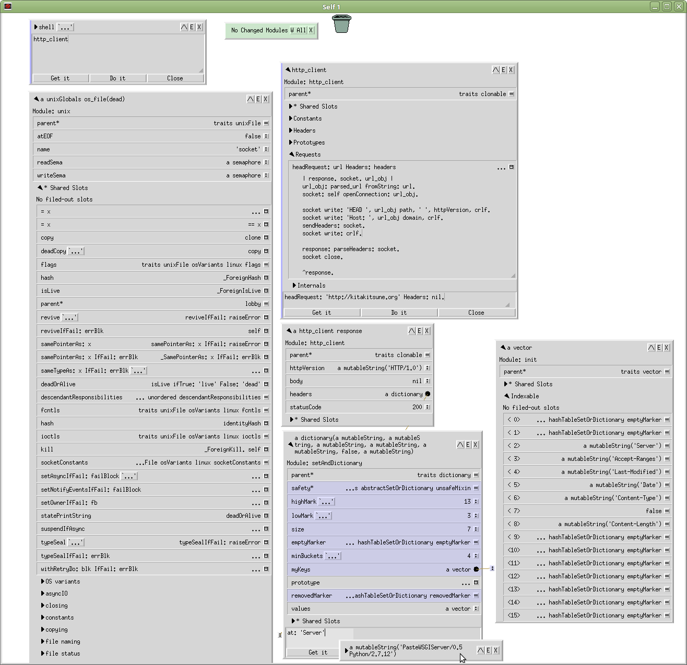

Také jsou v něm kompilátory pro programovací jazyk, celá standardní knihovna a tak podobně.

## Programovací jazyk

Programovací jazyk Self je na prototypech založený, objektově orientovaný jazyk Smalltalkovského typu.

*Na prototypech založený* znamená, že nepoužívá třídy k tvorbě objektů. Nové objekty vznikají buďto kopírováním, nebo na syntaktické úrovni vytvořením nového objektu ze zdrojového kódu.

*Smalltalkovského typu* znamená, že vše se točí kolem posílání *zpráv* objektům. Kromě pár základních syntaktických *suggar candy* zde nenajdete nic jiného, než posílání zpráv sem a tam.

Jako jazyk je Self velmi jednoduchý na naučení. Prakticky všechny vlastnosti programovacího jazyka se vejdou na [jednu stránku](https://github.com/SelfBatteries/SelfCheatSheet) o velikosti A4 i s popisky a vysvětlivkami.

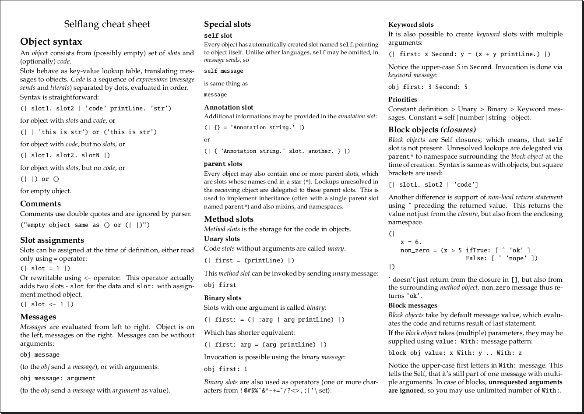

Tolik tedy ke krátkému přehledu. Podrobnostem se budu dále věnovat v následujících kapitolách.

## Interpret

Interpret a základní obraz si můžete stáhnout z oficiálních stránek [http://www.selflanguage.org/](http://www.selflanguage.org/). K dispozici jsou binární distribuce pro GNU/Linux a Mac OS X. Dostupné jsou také [zdrojové kódy](https://github.com/russellallen/self) pod OpenSource licencí, které si teoreticky můžete zkompilovat všude možně.

Prakticky to ale zas tak jednoduché nejspíš nebude, kvůli bindingům na grafický server a kvůli JIT kompilátorům, které je nutné odladit přímo na konkrétní rodinu procesoru.

Po stažení a rozbalení archivu na vás čekají hlavní soubory a několik vedlejších. Ty hlavní jsou:

- `Self`
- `morphic.snap`

První soubor je spustitelná binárka interpretru, druhý soubor je obraz paměti, do kterého bylo uloženo před-připravené prostředí s grafickým rozhraním.

## Self interpret

Po spuštění je možné nechat si vypsat nápovědu:

    $ ./Self -h
    ./Self: usage: ./Self [-f filename] [-h] [-s snapshot] ...
    Options:
      -f filenameReads filename (Self source) immediately after startup
      -hPrints this message
      -pDon't do `snapshotAction postRead' after reading snapshot
      -s snapshotReads initial world from snapshot
      -wSuppress warnings about optimized code being discarded
    For debugging use only:
      -FDiscards saved code from snapshot
      -l logfilewrite spy log to logfile
      -rDisable real timer
      -tDisable all timers
      -cUse real timer instead of CPU timer (for OS X)
      -oOversample the timers (Run them 10x faster to flush out bugs)
      -aTest the Assembler (added for Intel)
    Other command line switches may be interpreted by the Self world

## 32bitový systém

Pokud místo nápovědy uvidíte cosi jako

    ./Self: error while loading shared libraries: libX11.so.6: cannot open shared object file: No such file or directory

pak používáte 64 bitový systém, který nemá nainstalovanou podporu 32 bitových programů. Na debianu je možné nainstalovat potřebnou podporu následujícím způsobem:

    sudo dpkg --add-architecture i386
    sudo apt-get update
    sudo apt-get install libx11-6:i386 libxext6:i386 libtinfo5:i386

## Zpět k nápovědě

Zajímavé jsou v podstatě jen dva switche; `-f`, pro načtení `.self` souboru (což pravděpodobně jen tak nepoužijete) a `-s`, který načítá uložený obraz paměti. Zbytek jsou vesměs technické detaily vhodné pouze pro velmi pokročilé uživatele.

Pokud spustíte Self samotný, objeví se před vámi REPL (interaktivní režim), do kterého můžete psát příkazy:

    $ ./Self 
    Self Virtual Machine Version 2017.1/13, Tue 16 May 17 00:45:42 Linux i386 (4.5.0-205-gd942ba2-dirty)
    Copyright 1989-2016 AUTHORS (type _Credits for credits)
    
    for I386:  LogVMMessages = true
    for I386:  PrintScriptName  = true
    for I386:  Inline = true
    for I386:  SICDeferUncommonBranches = false (not implemented)
    for I386:  SICReplaceOnStack = false (not implemented)
    for I386:  SaveOutgoingArgumentsOfPatchedFrames = true
    VM#

Vzhledem k tomu, že Self jako interpret běžně operuje na úrovni image, a já žádnou nenačetl, jsem nyní v interpretru, kde kromě několika zabudovaných primitiv není v podstatě nic. Žádná standardní knihovna, skoro žádné objekty, kterým by se daly posílat zprávy. Self v tomhle stavu ani neumí sečíst dvě čísla, protože pořádně ani neví, co čísla znamenají.

Nápovědu je možné vypsat posláním zprávy (podrobnosti dále) `help`:

    VM# help
    '
    To begin using Self, you must read in the world of Self objects.
    To read in the world, type:
    
    'worldBuilder.self' _RunScript
    
    When this process is complete, you will be at the Self prompt.
    At the Self prompt, you can start the user interface by typing:
    
    desktop open
    
    
    ' <0>: ( | parent* = <1>. | byte array: {10, 9, 84, 111, 32, 98, 101, 103, 105, 110, 32, 117, 115, 105, 110, 103, 32, 83, 101, 108, ... (258 more elements) } )
    VM#

Nápověda (v podobě vráceného stringu) však moc užitečná není, jediné co nám ukáže je jak načíst svět z `.self` scriptů posláním zprávy `_RunScript` stringu s cestou ke scriptu.

Toto se hodí, když chceme vyrobit nový, „čistý“ image ze serializovaných zdrojových kódů. Toho je docíleno postupným vytvořením tisíců objektů tvořících standardní knihovnu na základě používání několika zabudovaných primitiv. Také je na to možné nahlížet jako na vybudování systému pomocí několika axiomů.

## Image

Přiložený subor `morphic.snap` obsahuje takto sestavený svět propojených objektů, tvořící standardní knihovnu a několik užitečných aplikací. Také obsahuje vlastní uživatelské rozhraní, které je implementováno kompletně v Selfu, s několika backendy na grafický server ([Xlib](https://en.wikipedia.org/wiki/Xlib) v případě Unixu/Linuxu, [Quartz](https://en.wikipedia.org/wiki/Quartz_(graphics_layer)) v případě OS X).

Self vás však nenutí používat tuto image. Můžete mít image, kde vůbec není grafické rozhraní, kde nejsou nahraná čísla, nebo kde je třeba jen webserver. Ačkoliv je v jedné image možné provozovat velké množství aplikací naráz, z praktických důvodů sám provozuji několik oddělených image.

# Z hlediska základů prostředí

Předtím, než se pustím do popisu jazyka bych rád prvně vysvětlil základy uživatelského rozhraní a vývojového prostředí Selfu.

Když Self poprvé spustíte, zobrazí se vám bílá obrazovka, jakási plocha. Umím si představit, že pro mnohé to může být šok. Když jsem sel poprvé pustil já, tak jsem ho po asi třiceti vteřinách zmateného koukání a klikání myší zase zavřel a smazal.

Strohá prázdná bílá plocha zrovna nepovzbuzuje k prozkoumávání toho na co jste narazili.

# Šok první: myšově orientované prostředí

Věc, kterou je z dnešního uhlu pohledu poměrně těžké překousnout je, že stejně jako grafické rozhraní operačního systému Plan9, tak i Self vznikl v době velkého nadšení z tehdy nové periferie: myši. Tvůrci si od ní slibovali velkou intuitivnost ovládání, proto se rozhodli udělat celé prostředí ovladatelné primárně z myši.

Věřte mi, že pokud si myslíte, že víte co očekávat z klasických grafických klikacích aplikací, tak nemáte tušení. V Selfu je myš nejenom primárním ovládacím prvkem, doslova kromě psaní kódu metod nemusíte na klávesnici ani sáhnout. I programovat se dá do jisté míry jen myší.

Pokud kliknete na plochu, tak levé i pravé tlačítko nedělají nic a prostřední vyvolá menu.

Z tohoto menu se dají (myší samozřejmě) vybrat základní nástroje a také je možné uložit obraz paměti, či vše ukončit.

# Šok druhý: programovací jazyk

Poměrně dlouho jsem si lámal hlavu jak tohle vlastně vysvětlit. Celé grafické rozhraní je programovací jazyk. Programovací jazyk je ovladatelný z grafického rozhraní, a věci, které se v něm dějí, se často zobrazují graficky.

Ten obdélník s nápisem `shell` vpravo nahoře představuje cosi jako konzoli, do které je možné psát příkazy. Zároveň se však také jedná o grafickou reprezentaci objektu programovacího jazyka, takzvaný *outliner*.

Šipka vlevo v roku umožňuje zobrazit jednotlivé sloty - prvky v objektu.

Jak je možné vidět, v tomto objektu jsou sloty `db*`, `shortcuts*` a `help`. První dva jsou takzvané parent sloty, tedy sloty odkazující se na objekty, do kterých je prováděna delegace nenalezených zpráv.

Tomuto objektu je možné poslat zprávu se jménem slotu a on vrátí její obsah. Zprávu je možné taky poslat graficky a on vrátí obsah graficky (bude ukázáno dále).

Tři tečky vedle názvu objektu umožňují zobrazit dokumentační komentář objektu.

Jedná se o docstring zadaný při vytvoření objektu.

Dále vidíme sérii tlačítek vpravo v rohu, které se zobrazují trochu divně, protože nemám nainstalované očekávané fonty. Tlačítko označené `/\` zobrazuje parent sloty. Když na něj kliknu, ocitnou se mi na pozici kurzoru a já je dalším kliknutím můžu položit na plochu.

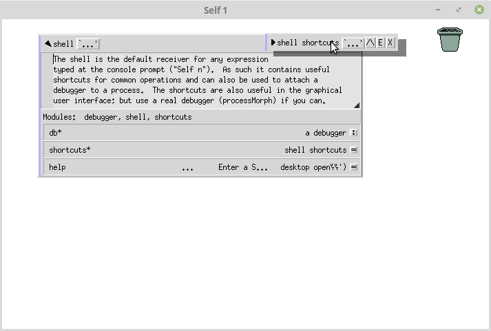

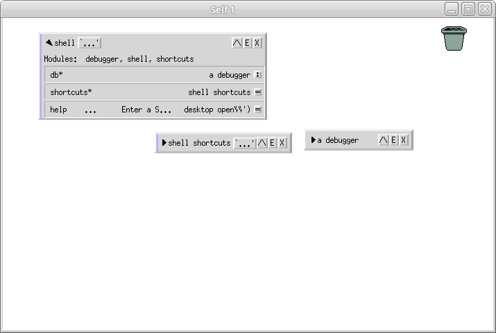

Že se jedná skutečně o *parent sloty* je možné zobrazit kliknutím na pravé boxíky na straně *parent slotů*:

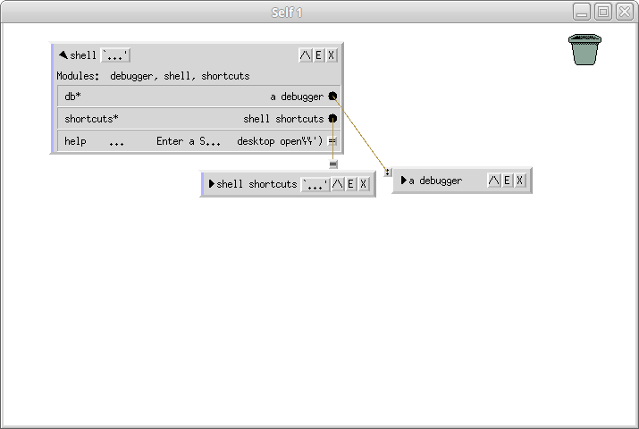

Důležité tlačítko je `E`, které se zobrazuje u všech outlinerů. To vám zobrazí vstupní pole, kterým můžete objektu posílat zprávy.

Zde můžete vidět poslání zprávy help, kterou odešlu kliknutím dole na `Get it`, či stisknutím `CTRL+enter`. To shellu říká, aby mi vrátil outliner pro objekt stringu. Mohl bych také zmáčknout `Do it`, což by způsobilo provedení zprávy a zahození vrácené hodnoty.

Vrácený outliner je samozřejmě možné dále prozkoumávat:

Vrácenému objektu můžu posílat zprávy, referencovat ho z jiných objektů a tak podobně.

Za zmínku stojí, že celé prostředí se chová jako gigantická 2D plocha, po které je možné scrollovat a skákat pomocí `WIN+šipka`.

# Šok třetí: paradigma uživatelského rozhraní

Uživatelské rozhraní se může zdát z dnešního pohledu ošklivé a divné. Je ovšem nutné jedním dechem dodat, že vzniklo v minulém století a od té doby na něj prakticky nikdo nesáhl.

To však neznamená, že by nemělo co nabídnout. Naopak, jedná se o konzistentní systém postavený na promyšlených principech, mezi které (mimo jiné) patří:

- Konkrétnost
- Uniformita
- Přímost
- Živost

## Konkrétnost

Pokud je na obrazovce zobrazen outliner, pro konkrétní objekt, ostatní objekty ho také používají k zobrazení.

Pěkný příklad je pokud si zobrazíte outliner pro `nil`:

V ukázce jde pěkně vidět, jak dva sloty ukazují na jeden konkrétní objekt. Outliner pro konkrétní objekt by neměl být na obrazovce víc jak jednou.

## Uniformita

Jak jednou pochopíte základy Morphicu (framework ve kterém je dělaný interface), všechno ostatní už se dá relativně intuitivně odvodit.

Například písmeno je objekt. Řádek písmen je složen ze stringu objektů v nějakém layoutu. Řádek sám je v layoutu, který je v layoutu okna. Vše se dá dynamicky měnit a upravovat.

## Přímost (Directness)

Objekty se chovají jako kdyby to byly skutečné fyzické objekty existující v realitě. Například je možné vyjmout z okna nápis a jen tak jeho kopii umístit do prázdného prostoru. Nejedná se o žádnou nesmyslnou vychytávku - podobně jako fyzické objekty, tak i grafické rozhraní v Selfu je prozkoumatelné a rozebratelné. A podobně, jako u fyzických objektů je možné ho použít ke konstrukci nových rozhraní.

Díky tomu, že jazyk je založený na konceptu prototypů a obrazech paměti, je možné takto složené grafické rozhraní dále používat a postavit z něj třeba aplikaci.

## Živost (Liveness)

Živost je jednak daná tím, že všechny objekty se překreslují pokud dojde k jejích úpravě, ale také použitím všemožných animací napříč celým uživatelským rozhraním.

Animace jsou většinou skryté na pozadí, například dojde k deformaci okna a vykreslení šedých blobů na místě kudy se pohybuje, čímž je pohybu dodán vjem rychlosti a konkrétního směru. Tyto techniky byly přímo inspirovány animovanými seriály.

Další příklad animace je když dostanete chybovou hlášku, třeba Syntax error a jen jeho box umístíte na plochu. Po čase sám odjede mimo obrazovku, aby nepřekážel.

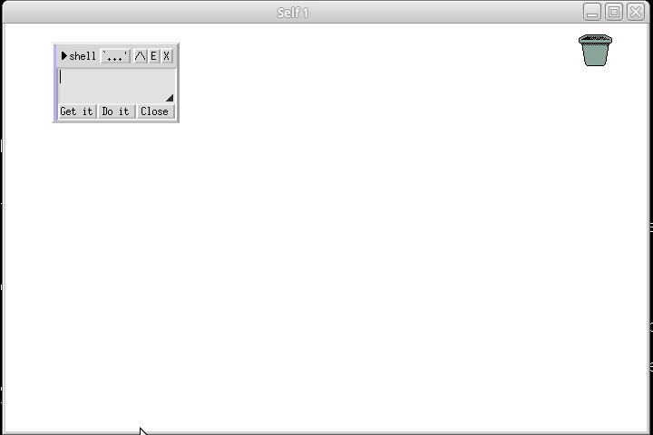

## K filosofii

Osobně mi na tom přijde vysoce zajímavý důraz kladený na možnost uživatele kompletně prozkoumat a podle své chuti modifikovat grafické prostředí. Autoři se poměrně úspěšně snažili nabídnout uživatelům možnost vytvářet poměrně jednoduchým způsobem vlastní grafická rozhraní, což je jinak věc, která je pro běžné lidi nad rámec Powerpointu prakticky nemožná.

Pokud vás principy zaujaly, pro další čtení doporučuji:

- [Animation: from cartoons to user interface](https://www.cc.gatech.edu/classes/AY2009/cs4470_fall/readings/animation.pdf)
- [Experiencing SELF Objects: An Object-Based Artificial Reality](http://bibliography.selflanguage.org/_static/experiencing-self-objects.pdf)
- [Directness and Liveness in the Morphic User Interface Construction Environment](http://web.media.mit.edu/~jmaloney/papers/DirectnessAndLivenessInMorphic.pdf)
- [The Self-4.0 User Interface: Manifesting a System-wide Vision of Concreteness, Uniformity, and Flexibility](https://www.researchgate.net/publication/242787183_The_Self-40_User_Interface_Manifesting_a_System-wide_Vision_of_Concreteness_Uniformity_and_Flexibility) (tenhle to vysvětluje obzvlášť pěkně)
- [The thing on the screen is supposed to be the actual thing](http://davidungar.net/Live2013/Live_2013.html) (prezentace Davida Ungara a Randalla B. Smitha), pokud se vám nenačtou videa, tak se dají stáhnout zde:
    - [http://davidungar.net/Live2013/Media/ARK video for Live Workshop-medium.m4v](http://davidungar.net/Live2013/Media/ARK%20video%20for%20Live%20Workshop-medium.m4v)
    - [http://davidungar.net/Live2013/Media/UI1 clip for Live Workshop-medium.m4v](http://davidungar.net/Live2013/Media/UI1%20clip%20for%20Live%20Workshop-medium.m4v)
    - [http://davidungar.net/Live2013/Media/UI2 clip for Live Workshop-medium-1.m4v](http://davidungar.net/Live2013/Media/UI2%20clip%20for%20Live%20Workshop-medium-1.m4v)

# Nástroje

Za zmínku stojí také běžně používané nástroje, které jsou k dispozici v Selfové image a repozitáři projektu.

## Outliner

Outliner je ta věc, ve které se dají editovat objekty. Je to v podstatě tabulkové zobrazení jednotlivých metod a properties objektu, které ovšem umožňuje pár věcí navíc:

- Vyhledávat v objektech a potomcích.
- Zobrazit shell, kterým je možné objektu posílat zprávy.
- Měnit jednotlivé properties objektu přetažením reference na jiný outliner.
- Přesouvat jednotlivé properties / metody mezi outlinery jejich vyjmutím či kopírováním a hozením pomocí drag&drop na jiný outliner.

Ukázka kontextového menu slotu v outlineru:

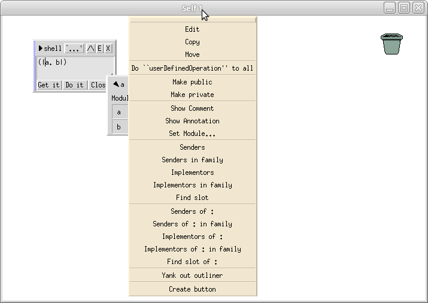

## Shell

Shell je jen outliner s předem nastavenými významnými rodičovskými sloty. Pokud otevřete shell pomocí `E` u standardního objektu, všechny zprávy se vykonávají v kontextu objektu, který outliner reprezentuje. Pokud se jedná o objekt bez rodičovských slotů, tak nemáte dostupné ani běžné objekty, jako `true` a `false`. Shell vám nabízí podstatně větší pohodlí v podobě rozšířeného namespace.

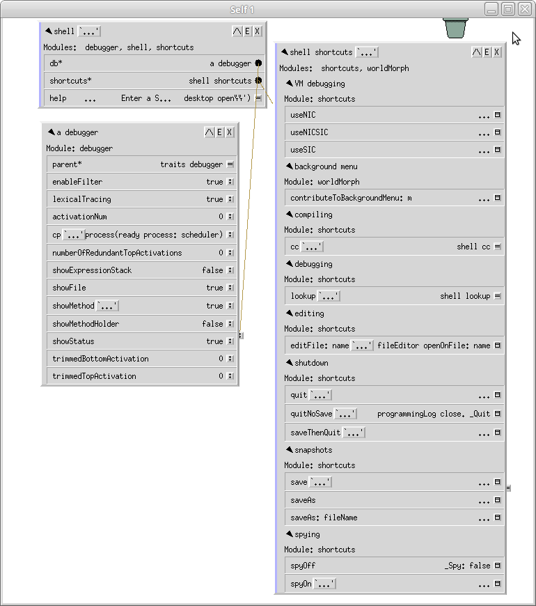

Vyvolat se dá kliknutím kolečkem kamkoliv na plochu a vybráním položky *New shell*.

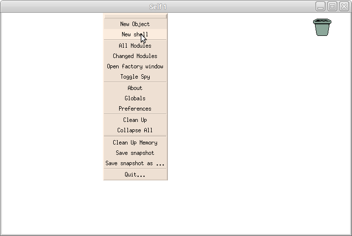

## Core sampler

Core sampler je na pohled taková divná věcička, kterou je možné vyvolat kontextovým menu (pravý klik) skoro z libovolného *morphu*.

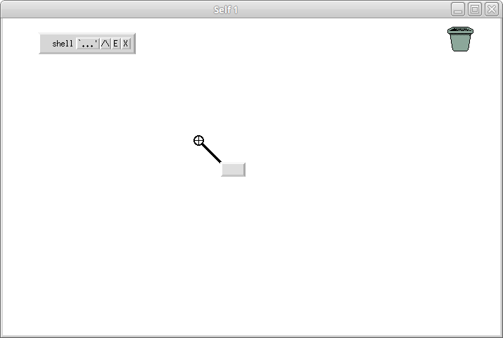

Na první pohled podivný zaměřovač s šedým boxem umožňuje provádět reflexi celého morphic interface zobrazením z čeho se skládá prostě tím, že ho myší přesunete nad konkrétní prvek který si přejete prozkoumat:

Z tohoto menu je možné okamžitě začít měnit vlastnosti jednotlivých vrstev morphů, upravovat jejich layout, pořizovat kopie a tak podobně.

Pokud vás zajímají detaily, sepsal jsem na tohle téma už kdysi článek [Reflexe grafických rozhraní](http://www.abclinuxu.cz/blog/bystroushaak/2017/1/reflexe-grafickych-rozhrani).

## Factory window

Z menu, které se zobrazí kliknutím kolečkem na prázdnou plochu je možné vybrat nástroj *factory window*. Ten zobrazuje seznam klávesových zkratek, ale i různé druhy *morphů* připravených k použití. Stačí na ně kliknout a přetáhnout je na prázdnou plochu a můžete začít vytvářet vaše uživatelské rozhraní jejich skládáním.

## Radar

Za zmínku stojí jakási obrazovka zhruba uprostřed vlevo. Jedná se o prototyp aplikace `radarView`, který můžete prostě vzít a přetáhnout na plochu.

Poté co ho zapnete vám poskytuje radarové zobrazení celé plochy.

*Morph* je také možné otevřít z konzole zadáním příkazu do *shell outlineru*:

    desktop w addMorph: radarView
    desktop w hands first addMorph: radarView

První příkaz zobrazí *morph* na kraji obrazovky, druhý příkaz vám ho vloží na pozici kurzoru, takže ho můžete položit kam chcete.

Příkaz je také možné vložit přímo do konzole, ze které Self spouštíte:

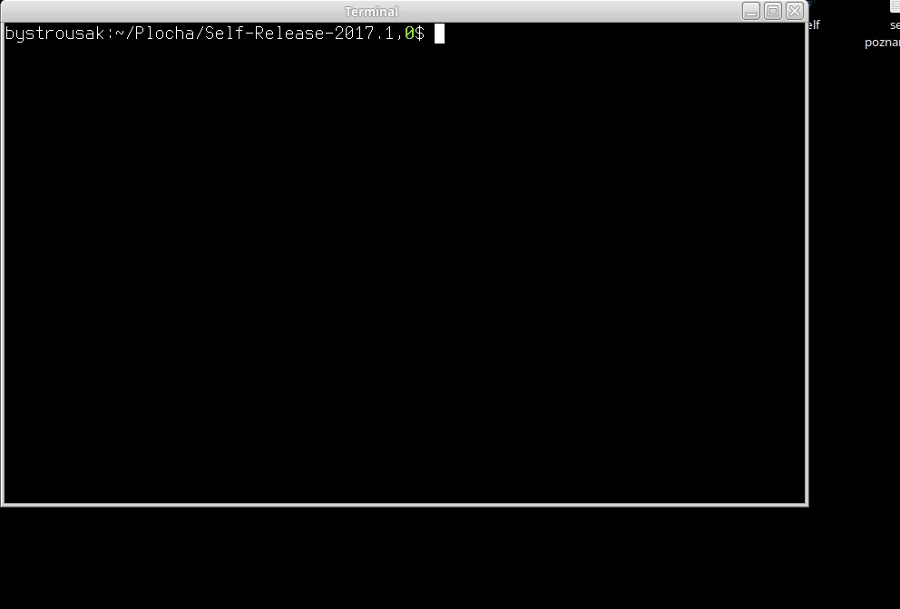

## Transporter

Transporter je Selfový způsob, jak z objektů v paměti udělat zpět zdrojový kód, který se dá poté třeba verzovat v klasických VCS, jako je Git.

Funguje tak, že konkrétní objekty o-anotujeme jako součást nějakého modulu, který je poté možné „zavést“ a „vyvést“.

Praktická ukázka přesahuje rozsah tohoto dílu, jak se to používá je však možné vidět například zde: [Exporting Self objects to source files using the Transporter](https://bluishcoder.co.nz/2015/11/19/exporting-self-objects-to-source-files-via-transporter.html)

Vyexportovaný kód je poněkud nečitelný, neboť je uložen jako sekvence direktiv transporteru. Ukázka zde: [http_client.self](https://github.com/SelfBatteries/http_client/blob/master/http_client.self).

Nutno ovšem dodat, že se jedná o serializaci, kde není zamýšlena editace programátorem, účelem je primárně distribuce a verzování. Editace by správně měla probíhat vždy uvnitř prostředí samotného Selfu přímou manipulací objektů.

## Ostatní

Kromě těchto nástrojů je možné také ve složce `objects/applications` repozitáře Selfu najít různé další nástroje, mezi které patří například:

- Parser Selfu psaný v Selfu
- implementace smalltalku
- Triviální webový prohlížeč
- Knihovnu pro výpočet sha1
- Implementaci fastCGI serveru pro poskytování webových stránek
- mySQL klienta

a tak podobně. Projekty jsou veskrze mrtvé a v různé fázi rozdělanosti. Některé fungují, jiné vypadají že byly zaváty časem.

# Z hlediska dokumentace

Jednak je tu wikipedie, kde na té české toho zatím moc není, zatímco na té anglické najdete poměrně komplexní úvod včetně mini tutoriálu jazyka:

- [https://cs.wikipedia.org/wiki/Self_(programovací_jazyk)](https://cs.wikipedia.org/wiki/Self_(programovac%C3%AD_jazyk))
- [https://en.wikipedia.org/wiki/Self_(programming_language)](https://en.wikipedia.org/wiki/Self_(programming_language))
- [https://www.abclinuxu.cz/blog/squeaker/2018/12/objektovy-model-jazyka-self](https://www.abclinuxu.cz/blog/squeaker/2018/12/objektovy-model-jazyka-self)

Jedním z mála koherentních zdrojů dokumentace jsou *Self papery*, takový archiv vědeckých prací, který je možné najít přímo v repozitáři na githubu:

- [https://github.com/russellallen/self/tree/master/docs/papers](https://github.com/russellallen/self/tree/master/docs/papers)

či v prezentovatelnější podobě na webu:

- [http://bibliography.selflanguage.org](http://bibliography.selflanguage.org/)

Pro nováčky je nejvhodnějším zdrojem Self handbook:

- [http://handbook.selflanguage.org](http://handbook.selflanguage.org/)

Jako úvod do grafického rozhraní je jeden z mála dokumentů použitelný starý tutoriál, který jsem provizorně nahodil zde:

- [http://kitakitsune.org/self/self_tutorial/](http://kitakitsune.org/self/self_tutorial/)

Pokud by měl někdo touhu přečíst celý maillist, tak archiv jsem dal sem:

- [https://github.com/SelfBatteries/self_mbox](https://github.com/SelfBatteries/self_mbox)

je tam poměrně hodně informací, ale upozorňuji na to, že čtení může zabrat celé týdny. Pokud by vás zajímal výcuc, tak ho můžete najít na Self blogu:

- [https://blog.selflanguage.org/2016/06/15/lessons-learnt-from-the-self-archive/](https://blog.selflanguage.org/2016/06/15/lessons-learnt-from-the-self-archive/)

spolu s dalšími články:

- [https://blog.selflanguage.org](https://blog.selflanguage.org/)

A to je tak nějak vše. Vše ostatní co kde najdete je vesměs zastaralé, neaktualizované a dnes irelevantní.

## Zajímavé papery

Mezi zajímavé *papery* rozhodně patří:

- [Programming as an Experience: The Inspiration for Self](http://bibliography.selflanguage.org/programming-as-experience.html)
- [Parents are Shared Parts: Inheritance and Encapsulation in Self](http://bibliography.selflanguage.org/parents-shared-parts.html)
- [Organizing Programs Without Classes](http://bibliography.selflanguage.org/organizing-programs.html)
- [Animation: From Cartoons to the User Interface](http://bibliography.selflanguage.org/animation.html)
- [Experiencing Self Objects: An Object-Based Artificial Reality](http://bibliography.selflanguage.org/experiencing-self-objects.html)
- [Getting Close to Objects: Object-Focused Programming Environments](http://bibliography.selflanguage.org/object-focus.html)
- [The Self-4.0 User Interface: Manifesting a System-wide Vision of Concreteness, Uniformity, and Flexibility](http://bibliography.selflanguage.org/self4.0UserInterface.html)
- [Directness and Liveness in the Morphic User Interface Construction Environment](http://bibliography.selflanguage.org/directness.html)
- [Sifting Out the Gold: Delivering Compact Applications From an Exploratory Object-Oriented Environment](http://bibliography.selflanguage.org/gold.html)

Co bych pak rozhodně nevynechával je:

- Constructing a Metacircular Virtual Machine in an Exploratory Programming Environment
- A Simple and Unifying Approach to Subjective Objects

A toto bylo doslova oči otevírající:

- A Simple, Symmetric, Subjective Foundation for Object-, Aspect- and Context-Oriented Programming
- Korz: Simple, Symmetric, Subjective, Context-Oriented Programming

---

Toliko tedy k prvnímu dílu. V příštích dílech se podíváme na samotný programovací jazyk a standardní knihovnu, filosofické a metafyzické přesahy a tak dál. Celkem by měl vyjít ještě díl, nebo dva, podle toho jak se mi to podaří rozdělit.

Paralelně s tímto seriálem jsem rozjel ještě jeden: Jak se píše programovací jazyk.