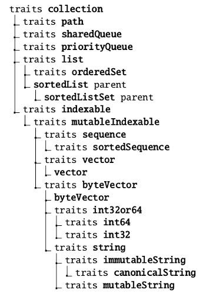

# Prostředí a programovací jazyk Selfu (díl druhý; jazyk)

2019/02/07

Minulý díl [Prostředí a programovací jazyk Selfu (díl první; prostředí)](https://www.notion.so/9740cb45-6680-4c9c-b530-a61efdf8f82a) představil Self jako projekt, ukázal kde ho stáhnout a jak se orientovat v prostředí morphic interface. Dnes se podíváme na jazyk samotný a jeho standardní knihovnu.

# Z hlediska jazyka

Self je syntakticky inspirován Smalltalkem. Však se také zrodil na stejném místě, v Xeroxu PARC, i když o desetiletí později. V Selfu se podobně jako ve Smalltalku vše točí kolem posílání zpráv. Oproti Smalltalku ale zavádí syntaktický konstrukt pro objekty.

Objekt je možné vnímat jako *key: val* (*klíč: hodnota*) úložiště. Jednotlivé klíče jsou v terminologii Selfu nazývány *sloty*.

Poté co objektu pošleme *zprávu*, je v paměti vyhledán obsah konkrétního slotu. Pokud se jedná o datový slot (objekt v něm uložený neobsahuje kód) je vrácen. Pokud se jedná o objekt s kódem, je vrácena hodnota zbylá po provedení kódu objektu.

Zprávu objektu pošleme tím, že jí napíšeme napravo od něj.

Kód

    obj zpráva

je podobný výrazu v C-like syntaxi:

    obj.zpráva()

## Syntaxe objektu

`()` vytvoří prázdný objekt. To je objekt, ve kterém nejsou žádné metody a který neumí reagovat na žádné zprávy.

Kód `(| a. b. |)` vytvoří objekt, ve kterém jsou dva sloty pojmenované jako `‚a‘` a `‚b‘`. Hodnoty obou budou nastaveny na `nil`.

Znak svislé čáry `|` uvozuje definici slotů. Jednotlivé sloty jsou odděleny tečkami. Výše uvedený objekt je „krabička“, která má v sobě dva šuplíky `a` a `b`. Ty můžou uchovávat data, či kód.

Objekt v Selfu funguje tak trochu jako hashmapa, či dictionary (slovník). Do konkrétního slotu se dá uložit konkrétní hodnota. Tuto hodnotu je možné přiřadit již při inicializaci:

    (| a <- nil. b = nil. |)

V příkladu je možné vidět hned dva styly přiřazení hodnoty. Liší se od sebe tím, že první je možné později přepisovat (`<-`), druhý (`=`) nikoliv.

Ve skutečnosti dochází na nízké úrovni v prvním případě k vytvoření dvou slotů - skutečného slotu a metody pro zápis do tohoto slotu. Ve druhém případě je vytvořen jen slot samotný a není tedy možné do něj zapsat. To má své využití pro různé konstanty.

Objekt dále může obsahovat kód, který je uveden za druhou svislou čarou `|`:

    (| a = 1 | a printLine)

Výše uvedená ukázka definuje nepojmenovaný objekt, který vytváří jeden slot `‚a‘` nastavený na objekt čísla `1`. Dále obsahuje kód spočívající v poslání zprávy `printLine` slotu `‚a‘`, tedy hodnotě v tomto slotu.

## Parent sloty

Speciálním typem slotů v Selfu jsou takzvané *parent sloty* (*rodičovské sloty*). Ty způsobí, že zprávy, které nejsou nalezeny v objektu jsou delegovány do objektů, na které ukazují tyto sloty.

Pokud pošleme objektu

    (| p* = traits clonable |)

zprávu `clone`, vrátí svojí vlastní kopii, i přestože v něm není metoda uložená ve slotu `"clone"`. Ta je však definována v objektu, na který odkazuje slot `p*`, či v nějakém nadřazeném, pokud tento objekt také obsahuje *parent slot*.

Tímto mechanismem je efektivně implementována dědičnost. Pokud se nad tím zamyslíte, podobá se chování situaci, kdy voláme metodu předka objektu dědícího z `"traits clonable"` například v pythonu.

## Parametry

Mezi `|sloty|` mohou být také parametry. Ty jsou uvozeny dvojtečkou v začátku názvu. Například objekt:

    (|
        x:Y: = (| :a. :b. | a printLine)
    |)

obsahuje jeden slot `‚x:Y:‘`, který odkazuje na objekt-metodu přijímající parametry `‚a‘` a `‚b‘`, který pošle parametru `a` zprávu `printLine`.

## Zprávy

Zprávy mohou být následujících typů:

*Unární*, například: `first`

*Binární*, například: `> a`

*Keyword*, například `set: a`, nebo také `set: a And: b`.

*Unární* zprávy nemají parametry. *Binární* mají přesně jeden parametr a používají se pro operátory. *Keyword* zprávy můžou mít libovolný počet parametrů. Na rozdíl od Smalltalku začínají další slova víceparametrové zprávy vždy velkým písmenem. Díky tomu je jasně vidět kde končí.

Zpráva `a first` najde v objektu `‚a‘` slot (property) nazvaný `"first"`. Pokud jsou v něm data, vrátí se. Pokud je v něm kód, vykoná se a vrátí se výsledek (poslední příkaz).

Zpráva `a > 1` najde v objektu `‚a‘` slot nazvaný `">"` a předá mu parametr `1`. Ve slotu tohoto typu může být jen kód (objekt-metoda), neboť vždy přijímá přesně jeden parametr.

Zpráva `x set: a And: b` najde v objektu `‚x‘` slot nazvaný `"set:And:"` a předá mu parametry `a` a `b`.

## Primitiva

Čtvrtým typem zpráv jsou *primitivní zprávy*, které poznáme podle toho, že začínají podtržítkem:

`_print`

`_set: s And: b`

Tyto zprávy se od ostatních liší tím, že jsou používány pouze pro volání primitiv interpretru, tedy částí implementovaných v C++.

Celý Self jako programovací prostředí je možné chápat jako jazyk vystavený na axiomech definovaných primitivy.

## Self

Self se jmenuje „Self“ protože na rozdíl od Smalltalku není třeba toto klíčové slovo uvádět před každou zprávou poslanou sama sobě.

Pokud objekt chce volat svojí vlastní metodu print, může v kódu jiné metody použít:

    self print

`self` však lze vynechat a zavolat pouze:

    print

Toto je poměrně zajímavá vlastnost, která stojí za zamyšlení. Každý identifikátor, který napíšete a není najit v namespace, je delegován do objektu samotného a dále do všech *parent slotů*. Co je vlastně lokální namespace, když objekt všechno implicitně pošle sám sobě?

## Bloky

Bloky fungují podobně jako objekty, až na tři rozdíly: jsou vyhodnocovány až v době běhu, chovají se, jako by automaticky obsahovaly *parent slot* ukazující do *namespace* (jmenného prostoru), ve kterém byly vytvořeny a automaticky mají nastavený `parent*` na `traits block`.

Díky těmto vlastnostem fungují jako *closures* známé z ostatních programovacích jazyků.

`[]` tvoří prázdný blok.

Podobně jako objekty i bloky můžou obsahovat sloty: `[| a <- 1. |]` vytvoří blok obsahující slot `‚a‘` o přepisovatelné hodnotě `1`.

Bloky také můžou přijímat parametry: `[| :a | a printLine]` a tvořit například *code objekt*, který očekává jeden parametr a ten při zavolání vypíše. Jak blok zavolat? Stačí mu poslat zprávu `value`, případně `value:`, pokud přijímá jeden parametr a `value:With: .. With: ..` pokud jich přijímá více.

Pomocí bloků jsou v Selfu implementovány veškeré kontrolní prvky. Větvení if podmínkami, cykly a tak dále.

Například *if podmínka* jen *keyword zpráva* `ifTrue:`, či `ifTrue:False:` bool objektu, které se jako parametr předává blok s kódem:

    (| :a. :b. |
        (a > b) ifTrue: [^a] False: [^b].
    )

Zde vidíte *code object* přijímající parametry `‚a‘` a `‚b‘`, které porovná mezi sebou (posláním binární zprávy `> b` objektu `a` a výslednému bool objektu poté pošle zprávu `ifTrue:False:` s prvním parametrem obsahujícím blok vracející `‚a‘` a druhým parametrem obsahujícím blok vracející `‚b‘`.

Znak stříšky `^` znamená *return*. Použit v bloku, vrací hodnotu nikoliv jen ze samotného bloku, ale i z nadřazeného *namespace*. V uvedeném případě tedy dojde k vrácení hodnoty z celého *code-objectu* / metody, nikoliv jen z bloku (to lze provést pomocí zprávy `return:`).

Obecně co se týče návratových hodnot, tak je možné použít `^` k vrácení hodnoty, nebo hodnotu poslední zprávy v daném kódu.

    (|
        parent* = traits boolean.
        a = (true ifTrue: [1])
    |)

Zde vidíme definici objektu, který obsahuje *parent slot* odkazující se na `traits boolean`. Tím nám zpřístupní kromě jiného i zprávu `true`.

Metoda uložená ve slotu `‚a‘` potom pošle zprávu `true` sama sobě, což vrátí skrz delegaci na slot `true` definovaný někde v `traits boolean` kopii objektu obsahujíciho hodnotu `true`. Tomuto objektu je poté poslána *keyword zpráva* s blok parametrem, který obsahuje kód pouze s objektem `1`.

Protože je objekt `1` poslední hodnotou v bloku, dojde k vrácení jeho hodnoty. Výsledek ze zprávy `ifTrue:` je také vrácen a stává se tak poslední hodnotou v metodě uložené ve slotu `‚a‘` a je tedy vrácen jako hodnota.

## Delegace

Jak už jsem psal - Self obsahuje cosi, co funguje jako dědičnost, ale dědičností není. Jedná se o delegaci zpráv, kterým objekt nerozumí, na objekt definovaný v *parent slotu*.

Objekt může mít *parent slotů* víc, v některých případech je tak nuté specifikovat, z jakého *parent slotu* se má slot vybrat. To je možné takzvaným *resend* slotem. Ten se definuje jako `parent.message`.

Například pokud by jsme měli objekt:

    (|
      firstParent* = traits something.
      secondParent* = traits different.
    |
    
       copy.
    )

a pokud by oba objekty na které odkazují *parent sloty* definovaly slot `copy`, bylo by nutné vybrat konkrétní *resend* manuálně pomocí tečky takto: `secondParent.copy`.

Delegace je poměrně zajímavý koncept, který jak je vidět umožňuje jak jednoduchou, tak vícenásobnou dědičnost. Kromě toho ale umožňuje i věci, které klasické jazyky nenabízí a to je například měnit *parent slot* za běhu a efektivně tak přepínat, na který objekt jsou nenalezené zprávy delegovány.

Na první pohled poněkud divoká konstrukce má docela zajímavé využití například při psaní parserů, kde umožňuje měnit kontext.

## Komentáře

Komentáře se píší do uvozovek:

    "toto je komentar"

## Anotace

Anotace jsou způsob přidávání metadat k objektům, kterému se dokumentace překvapivě málo věnuje, přestože je použít napříč celou image.

Syntaxe používá složené závorky:

    (|
      p* = traits clonable.
      {'Category: accessing'
        slot = nil.
      }
    |)

Což například řekne grafickému rozhraní, aby slot zobrazilo v kategorii accessing:

Osobně mi anotace přijdou syntakticky poněkud matoucí a podařilo se mi způsobit všelijaké druhy errorů, když jsem jen tak vytvářel anotace s různými náhodnými popisky:

Přesto anotace jsou použity všude, především však pro Transporter, který si pomocí nich označuje který objekt patří do jakého modulu, kdy byl naposledy updatován a tak podobně.

Anotace jako takové nejsou vidět v samotném objektu pomocí například Outlineru, k tomu je zapotřebí použít mirror (viz následující kapitola).

# Z hlediska Stdlib

Chyták jednoduchých jazyků, jejichž syntaxe se příslovečně vejde na pohlednici, spočívá především v přehození složitosti na stdlib. Self v tomhle není výjimka, proto nebudu ukazovat úplně celou stdlib, jen některé části. Zvědavý čtenář si může konkrétní detaily zobrazit v samotném Selfu.

# Podmínky

Jak bývá v jazycích smalltakovského typu zvykem, if podmínky jsou implementovány jako zprávy objektu typu bool. K dispozici jsou zprávy:

- `ifTrue: []`
- `ifFalse: []`

a jejich ekvivalenty s "else" větví:

- `ifTrue: [] False: []`
- `ifFalse: [] True: []`

# Cykly

Podobně jako podmínky, tak i cykly jsou realizovány jako zprávy posílané buďto kolekcím, nebo objektu bloku.

Základní zprávou je `loop`:

- `[ ... ] loop`

Toto způsobí, že tělo bloku bude voláno do nekonečna.

Dále jsou k dispozici podmíněné smyčky:

- `[ podmínka ] whileTrue: [ ... ]`

a ekvivalenty `whileFalse:`, `untilTrue:`, `ultilFalse:`, `loopExit` and `loopExitValue`.

Dalšími cykly jsou `do:` zprávy číselným typům, s alternativami v podobě `to:Do:` a `to:By:Do:`, které cyklí od do nějaké hodnoty, podobně jako třeba iterátor `range()` v pythonu.

K dispozici jsou také různé transformátory a iterátory nad kolekcemi, které fungují podobně. Například lze poli poslat zprávu `mapBy:`, `mapBy:Into:`, `gather:`, `filterBy:` a tak podobně.

V tomhle ohledu doporučuji se vždycky podívat na danou kolekci. Zpráv tohoto druhu je tam několik desítek a umožňují vše od filtrování po vyhledávání, sortování, mapování, transformování, počítání výskytu a tak podobně. Dá se říct, že těch zpráv je víc než třeba v pythonu.

Čistě pro zajímavost, jen kolekce typu `list` reaguje na tyto zprávy:

    <= x
    > x
    >= x
    areKeysOrdered
    copare: x IfLess: lb Equal: eb Greater: gb
    copy
    KeyedStoreStringIfFail: fb
    max: x
    min: x

## Accessing

    at: k
    at: i IfAbsent: b
    first
    first: v
    firstIfAbsent: noneBlk
    isEmpty
    last
    firstLinkFor: elem IfPresent: presentBlock ifAbsent: absentBlock
    firstLinkSatisfying: conditionBlock IfPresent: presentBlock ifAbsent: absentBlock
    ifNone: noneBlock
    ifNone: noneBlock IfOne: oneBlock IfMany: manyBlock
    keys
    last: v
    soleElement

## Adding

    add: elem
    add: v WithKey: k
    addAll: c
    add:allFirst: c
    addFirst: elem
    addLast: elem

## Coercing

    asList

## Comparing

    < c
    = c
    compare: c IfLess: lb Equal: eb Greater: gb
    hash
    isPrefixOf: c
    isSuffixOf: c
    equalsCollection: c

## Concatenating

    , c

## Copying

    copy
    copyContaining: c
    copyRemoveAll

## Double dispatch from universalSetOrDictionary

    unsafe_with: c1 Do: b FirstKey: firstK1 FirstValue: firstV1

## Inserting

    insert: x AfterElementSatisfying: blk IfAbsent: aBlk
    insert: x BeforeElementSatisfying: blk IfAbsent: aBlk
    insertAll: x AfterElementSatisfying: blk IfAbsent: aBlk
    insertAll: x BeforeElementSatisfying: blk IfAbsent: aBlk

## Iterating

    do: b
    doFirst: f Middle: m Last: lst IfEmpty: mt
    reverseDo:
    with: x Do: b
    with: x ReverseDo: b
    withNonindexable: c Do: b

## InteratingWithEnds

    do: elementBlk SeparatedBy: inBetweenBlk
    doFirst: f Middle: m Last: lst
    doFirst: f Middle: m Last: lst IfEmpty: e
    doFirst: f MiddleLast: ml
    doFirst: f MiddleLast: ml IfEmpty: e
    doFirstLast: f Middle: ml
    doFirstLastt: f Middle: ml IfEmpty: e
    doFirstMiddle: fm Last: lst
    doFirstMiddle: fm Last: lst IfEmpty: e

## Printing

    collectionName
    comment1
    printStringSize: smax Depth: dmax
    statePrintString
    storeStringForUnkeyedCollectorIfFail: fb
    storeStringIfFail: fb
    storeStringNeeds
    unkeyedStoreStringIfFail: fb
    buildStringWith: block
    continued
    defaultPrintSize
    leftBracket
    minContentsSize
    minElSize
    printStringKey: k
    rightBracket
    separator
    statePrintStringOfElements
    statePrintStringOfSize

## Reducing

    countHowMany: testBlock
    dotProduct: aCollection
    harmonicMean
    max
    mean
    median
    min
    percentile: nth
    product
    reduceWith: b
    reduceWith: b IfSingleton: sb
    reduceWith: b IfSingleton: sb IfEmpty: mt
    rootMeanSquare
    standardDeviation
    sum

## Removing

    remove: x
    remove elem IfAbsent: block
    removeAll
    removeAll: aCollection
    removeFirstIfAbsent: ab
    removeLast
    removeLastIfAbsent: ab

## Searching

    allSatisfy: b
    anySatisfy: b
    findFirst: eb IfPresent: fb
    findFirst: eb IfPresent: fb IfAbsent: fail
    includes: v
    keyOf: elem
    keyOf: elem IfAbsent: ab
    noneSatisfy: b
    occurrencesOf: v
    occurrencesOfEachElement

## setLikeOperations

    includesAll: c
    intersect: c
    difference: c

## Sizing

    isEmpty
    nonEmpty
    size

## Sorting

    ascendingOrder
    comment2
    copySort
    copySortBy: cmp
    copySortBySelector: sel
    isAlreadyKnownToBeSortedBy: cmp
    sortedBy: cmp Do: b
    sortedDo: b

## Testing

    isOrdered

## Transforming

    asByteVector
    asDictionary
    asList
    asOrderedSet
    asSequence
    asSet
    asString
    asTreeBag
    asTreeSet
    asVMByteVector
    asVector
    copyFilteredBy: eb
    copyMappedBy: eb
    filterBy: filterBlock
    filterBy: eb Into: c
    gather: aBlock
    gather: aBlock Into: aCollection
    mapBy: eb
    mapBy: eb Into: c

To není zrovna málo, že?

# Datové struktury

Datové struktury jsou složené v hierarchiích traitů, které na sebe postupně vrství jednotlivou funkcionalitu.

Všechny kolekce jsou založeny na key-value párech, dokonce i seznamy jsou na tomto založeny, s tím že jednotlivé prvky jsou použity zároveň jako klíče i jako hodnoty.

Self nabízí poměrně bohatou variaci *setů*, *slovníků* a *stromů*:

Stromy se od slovníků liší použití nebalancovaných binárních stromů, což může vést k degeneraci a špatnému výkonu.

Dále je také přítomna variace *seznamů*, *vektorů*, *stringů* a *front*:

Mezi nejdůležitější zprávy podporované prakticky všemi kolekcemi patří:

[Nejdůležitější zprávy](https://www.notion.so/9851930d27224119b2eb00626d1917cc)

## Ukázka

Pokud chcete kolekci použít, prostě napíšete do shellu / kódu její jméno a naklonujete jí. To je možné provést příkazem `clone`, či `copy` (jedná se o to samé).

Je opravdu důležité nezapomenout kolekci naklonovat, protože ostatní prototypy si jí berou ze stejného místa a pokud do ní začnete cpát data, všechny ostatní kus kódu s tím budou začínat!

Nyní kliknu na *Get it*.

Objekt si položím na plochu a „rozbalím“ pomocí šipky vlevo v rohu:

Vidím, že v něm je nula prvků (`size 0`). Otevřu si v něm tedy shell a zkusím do něj něco přidat:

Nyní zvolím Do it, protože hodnotu volání zprávy nechci získat „do ruky“ jako outliner, chci jen provést kód.

Jak je vidět, hodnota se změnila. Nyní se můžu podívat třeba co je zač objekt vrácený na zprávu `values`.

A zde je výsledek outliner. Položím si ho na plochu..

.. a rozbalím, abych se podíval dovnitř:

Jak můžu vidět, ve vektoru je na indexu `1` hodnota `'value'`, přesně tak jak jsem chtěl. Jen připomínám, že dictionary je nesetřízený.

Divného vzhledu shellu vlevo nahoře si nevšímejte, mám nějak rozbité ovladače na grafiku a Self používá tak prehistorické bindingy na X, že mi to celé laguje a překresluje se to divně. Na notebooku mi to funguje jak má.

Zde je ještě ukázka, kde si pomocí zprávy `do:` nechám vypsat prvky a klíče do konzole:

`do:` podobně jako všechny iterátory v Selfu očekává blok, který může mít dva volitelné parametry, hodnotu a klíč pojmenované v ukázce pro jednoduchost `v` a `k`. Všimněte si poněkud divného pořadí, člověk by to logicky čekal naopak.

# Collector

Collector je speciální datová struktura, která reaguje na binární zprávy `&`. V podstatě existuje protože Self nemá literál pro vytváření polí. Pokud chceme vytvořit pole, nejjednodušší způsob je collectorem:

    (1 & 2 & 3) asList

Collector není ani pole, ani dictionary, ale dá se na všechny možné struktury zkonvertovat posláním zprávy as*Něco*.

# Výjimky

Výjimky v Selfu jednoduše nejsou podporovány. Zprávy, které můžou skončit nějakou chybou nabízají zpravidla alternativu v podobě keyword zprávy s parametrem `IfFail:`. Hezky to jde vidět třeba na objektu pro přístup k operačnímu systému:

Je na programátorovi, aby použil a ošetřil patřičnou chybu (předáním parametru s blokem který na chybu reaguje). Pokud to neudělá, měl by se zobrazit debugger, nebo program spadne.

Stejně tak pokud umožňujete jako programátor nějaké knihovny ošetření chyby, je třeba přidat variantu zprávy s `IfFail:` parametrem.

Osobně mi to nepřijde jako úplně nejšťastnější řešení, ale co se dá dělat.

# Objektový model

Poznámka: poměrně zajímavá diskuze na téma objektového modelu Selfu se strhla zde: [https://news.ycombinator.com/item?id=14409088](https://news.ycombinator.com/item?id=14409088)

Jak už jsem vysvětloval, Self používá na prototypech založený objektový model. Ten se dá shrnout pod tvrzení, že nové objekty kopírujete zprávou `clone` či `copy`, nebo vytváříte prázdné v zdrojovém kódu s odkazem na nějakého `parenta*` dodávající funkčnost podobnou dědičnosti.

Co se týče hierarchie různých objektů, tak ty se dělí mezi *traity* a *mixiny*.

## Traity

Jedná se o *„předky“*, tedy objekty obsahující sdílenou funkcionalitu, které často nejsou samy o sobě plně funkční. Tyto objekty jsou vytvářeny za účelem aby na ně ostatní odkazovaly `parent*` sloty.

Self má poměrně bohatou hierarchii *traitů*, jak je možné vidět například v předchozích kapitolách na ukázce kolekcí.

## Mixiny

Mixiny jsou malá klubíčka sdílené funkcionality, typicky bez `parent*` slotu, sdílená je na nějaké úrovni. Jejich smyslem má být funkcionalita, která je *zmixována* do objektu. Jejich ekvivalentem je něco jako interface s částečnou implementací.

# Reflexe pomocí zrcadel

Zrcadla jsou specialitou Selfu, kterou jsem snad v žádném jiném programovacím jazyce neviděl. Široce používané programovací jazyky zpravidla řeší reflexí pomocí různých interních properties. Python například používá `.__class__`, či `.__dict__`, nebo `.__name__` pro přístup k interním informacím o objektu.

Self používá zrcadla. Zrcadlo vytvoříme posláním zprávy `reflect:` objektu majícímu někde v parent hierarchii `traits clonable`.

Tím získáme objekt *mirrorující* (zrcadlící) objekt předaný jako parametr.

Zde můžeme vidět, že v něm je pseudoslot odkazující se na mirrorovaný objekt.

Pokud si rozklikneme parenta, můžem se podívat na co všechno za zprávy umí reagovat:

Všímejte si, že skáču po ploše doleva a doprava zkratkami WIN+šipka. Nyní jsem skočil o půl plochy doprava.

V `traits mirrors slots` parentovi vidíme, že toho moc neumí, podíváme se tedy do jeho parenta:

Zde je vidět bohatý seznam kategorií, které nám umožňují se zrcadlem dělat všechno možné:

Například se podívat na seznam zpráv na které reaguje:

Což vidíme že je prázdný set:

Pro vysvětlenou: objekt, ke kterému jsme vytvořili mirror neobsahuje žádné zprávy, jen dva sloty. Mezi zprávy se v tomto kontextu počítají objekty vykonávající kód.

Samotné sloty je možné zobrazit zprávami z kategorie `slotAccess`:

Zde je možné například příhodně vyzkoušet `firstKey`

Odpověď byla skutečně jméno slotu „a“. Pokud si zobrazím hodnotu na klíči „a“, dostanu očekávaný výsledek:

Krása mirrorů je, že se dají zakázat. Prostě vám stačí odstranit z kódu, kde je chcete zakázat zprávu `reflect:` například jejím přepsáním za objekt vracející `nil`. Tím je možné relativně bezpečně vykonávat kód pomocí funkcí jako eval (samozřejmě pokud zároveň odstraníte i třeba přístup k syscalům a filesystému).

# Z hlediska tipů a triků

Časem jsem v osobní wiki nasbíral užitečné poznámky, tipy a triky které člověku můžou zpříjemnit programování v Selfu.

## Podpora copy

Aby objekt podporoval zprávu `copy`, musí dědit nějakou základní funkčnost. Tu je možné najít v `traits clonable`.

## Zobrazení parent slotů v outlineru

Je poněkud nešťastné otevírat v outlineru neustále `parenty*`, abych viděl co mám k dispozici za poděděné sloty.

Outliner se dá naštěstí jednoduše nakonfigurovat tak, aby zobrazoval i poděděné sloty nastavením:

    preferences outliner kevooidal: true

Ukázka:

## Otevření všech podkategorií

Občas je velmi otravné rozklikávat černé šipky, pokud máte víc vnořených kategorií. Dvojklik na šipku zároveň otevře i všechny podšipky.

## Ukončení posláním zprávy

Prostředí je možné ukončit zprávou `saveThenQuit` či `quitNoSave` i z kódu. Osobně si rád vytáhnu na plochu tlačítko, které po zmáčknutí volá jednu z těchto zpráv, což mi šetří trochu času.

## Zbuildění nového světa

Pokud nechcete používat image dodávanou s distribucí Selfu a z nějakého důvodu si chcete vybuildit vlastní, lze to provést z adresáře `objects/` v repozitáři zdrojových kódů projektu (pozor, je skutečně nutné přijít do tohoto adresáře) pustěním příkazu:

    Self -f worldBuilder.self -o morphic

`-o` nespecifikuje jméno výstupního souboru (!) ale overclock a `morphic` parametr říká, že se má zbuildit i grafické rozhraní.

Poté co script doběhne to chce do konzole zadat:

    desktop open

pro otevření grafického rozhraní, nebo ho můžete uložit příkazy z předchozí podkapitoly.

## Vyhledávání

Z libovolného outlineru je možné prostředním tlačítkem vyvolat menu „*Find slot*“:

To vám dá k dispozici objekt, který vám umožňuje hledat sloty podle názvu:

Dolu se zadává root, ze kterého se bude hledat, nahoru pak co se má vyhledávat:

Input bary se schvalují kliknutím na zelený čtvereček, nebo stiskem CTRL+enter. Kliknutím na šipku vlevo nahoře dojde ke spuštění vyhledávání:

Jednotlivé sloty je možné otevřít kliknutím na čtvereček vedle nich..

Či z kontextového menu je možné s nimi provádět různé operace:

## Načtení uloženého scriptu

Pokud si chcete spustit nějaký ze scriptů, nebo načíst váš uložený modul, dají se k tomu použít dva přístupy:

    bootstrap read: 'name' From: 'directory'

Všimněte si že na konci name není `.self`, nebo:

    'path to file.self' runScript

Podrobnosti zde: [Reading a module](http://kitakitsune.org/bhole/self_tutorial/Language/ImportantObjects/ReadingModules.html).

## Radarview

Jak už jsem psal, radarView je možné zobrazit takhle:

    desktop worlds first addMorph: radarView

nebo

    desktop w hands first addMorph: radarView

## Lepší fonty

Pokud vám přijde základní font Selfu hrozný, tak skutečně je. Původně hledá verdanu, ale na linuxu se mu jí nepodaří najít, takže použije fallback. Řešení je popsané tady:

- [https://bluishcoder.co.nz/2015/01/08/improving-linux-font-support-in-self.html](https://bluishcoder.co.nz/2015/01/08/improving-linux-font-support-in-self.html)

## Editor morph

Experimentálně jsem zjistil, že to chce `editorRowMorph`, ve kterém je zastrčený `editorMorph`. Reaguje na `contentsString`.

Jak se používají `ui2_textField`, `ui2_textBuffer`, `textViewerMorph` a `uglyTextEditorMorph` jsem nezjistil.

# Pokračování

V příštím díle se podíváme na historii Selfu, komunitu kolem něj i některé praktické aspekty programování v něm.