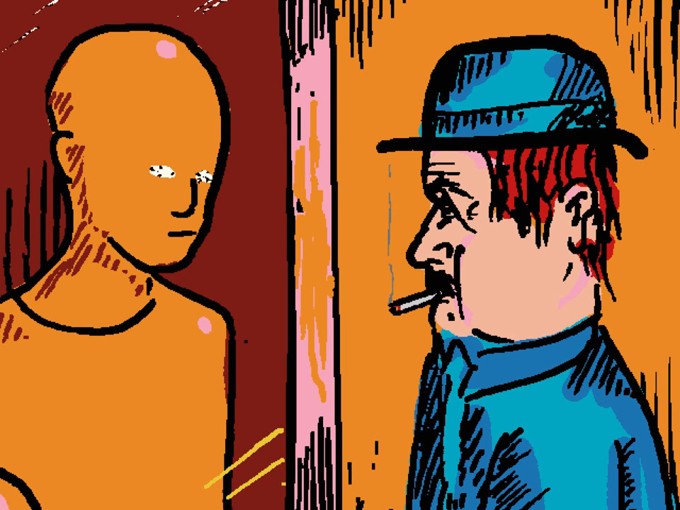
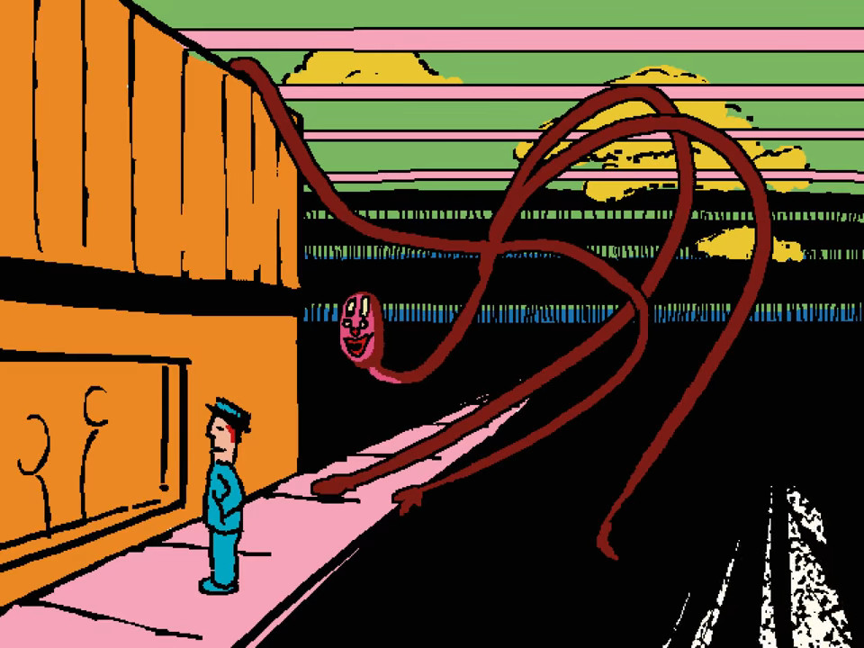
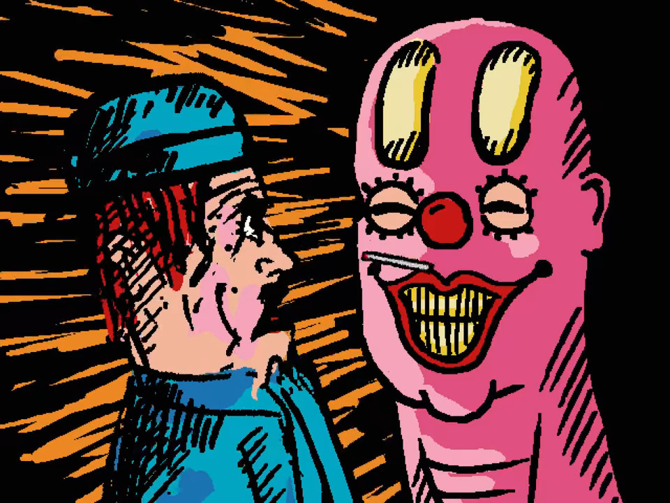

# Představení: umami (youtube kanál)

`u m a m i` je youtuber, jako málokterý jiný. Jeho animované příběhy se postupně řadí mezi velikány žánru podivných filmů, jako je [David Firth](https://www.youtube.com/watch?v=OfAul2isPfo), [Brad Neely](https://www.youtube.com/watch?v=a9GoWGnFzGA), či Jason Steele.

Kromě podivných videií, jako Pong,

[https://www.youtube.com/watch?v=Cu6wlaaf-ck](https://www.youtube.com/watch?v=Cu6wlaaf-ck)

Thomas the Thermonuclear Bomb

[https://www.youtube.com/watch?v=_MBgz9h7GGM](https://www.youtube.com/watch?v=_MBgz9h7GGM)

či polívek

[https://www.youtube.com/watch?v=5HvrySwhZrQ](https://www.youtube.com/watch?v=5HvrySwhZrQ)

[https://www.youtube.com/watch?v=uraG-z0grkc](https://www.youtube.com/watch?v=uraG-z0grkc)

vydává také sérii Interface. A Interface je to, co považuji za skutečné umění.

[https://www.youtube.com/watch?v=EHqsCmfTDmI](https://www.youtube.com/watch?v=EHqsCmfTDmI)

Interface začíná podivně. První epizody mě skoro nudily. `u m a m i`, civilním jménem Justin Tomchuk nás v nich uvede do dvou postav; Mischiefa (neštěstí) a muže v modrém, o kterém se později dozvídáme, že se jmenuje Henryk. Henryk stojí u výlohy a dívá se do statického šumu v očích manekýnů.

Tento šum, nazývaný „cerebral electricity“ (mozková elektřina) je ve světě interface častým tématem, které by se přibližně dalo připodobnit k magii. Tam kde je šum, tam se realita chová divně.

To vzápetí předvádí Mischief, tvor neustále měnící tvary, který se objeví za Henrykem a překvapí ho.

V krátkosti se představí a vysvětlí, že byl jeden z námořníků na palubě lodi [filadelfského experimetu](https://cs.wikipedia.org/wiki/Filadelfsk%C3%BD_experiment), při kterém byl zničen a donucen přijmout svou nynější fyzickou podobu měňavce.

V době psaní tohoto blogu je na světě dvanáct epizod, z nihž každá další nám ukazuje putování Henryka s Mischiefem po podivně dystopickém světě ve stylu velkého bratra z 1984. Postupně se dovídáme, že i Henryk je speciální, tak jako Mischief, že „mozková elektřina“ je využívána korporací *Greetings robotics* napojenou na vládu a že tvorů, kteří jsou jí ovlivněni je na světě hodně.

## Výtvarná stránka

Co na animacích od `u m a m i` zaujme od prvního pohledu je výtvarná stránka. Animace se na první pohled tváří, jako kdyby šlo o něco tvořeného v malování. Používá jen pár barev, tlusté černé čáry, občas jen přibližné malby postav.

Ač to tak může působit, jedná se ve skutečnosti o záměr. Autor na youtube často pořádá live ukázky práce, kde je možné vidět jak 3D modeluje jednotlivé scény. Častým tématem jsou rotující věci a falešně dodané „zrnění“, které dodává živost i statickým scénám.

Další věcí vynikající hlavně od šesté epizody je hudba. Jedná se o pomalé melancholické instrumentální kusy, které se v klíčových okamžicích naplní emocemi a dokreslí scény neskutečným způsobem. Proslov Henrykovy dcery a hudební podklad z konce [šesté epizody](https://www.youtube.com/watch?v=o4Ce-xG_HIQ) jsem si pouštěl snad dvacetkrát a považuji ho za dokonale zpracované dílo.

Pokud se vám nechce na Interface koukat, doporučuji tento speciál k 100 000 odběratelům, který krásně ukazuje všecho o čem jsem psal, od hudby po výtvarnou stránku.

[https://www.youtube.com/watch?v=MhC4PowEZCE](https://www.youtube.com/watch?v=MhC4PowEZCE)

A pak je tu příběh. Ten odlišuje Interface od mnoha jiných animovaných záležitostí, protože není triviální. Na redditu se po každé epizodě najdou spousty lidí, kteří se jí snaží rozebrat a pochopit a krása všeho je, že to může mít mnohovrstevnaté vysvětlení. Některé části je možné vidět jako paralely s masmédii dvacátého století, ovlivňováním lidí a konzumerskou kulturu. Jiné jako narážky na filosofické problémy.

---

`u m a m i` možná není pro každého, ale mně přesně sednul do vkusu. Ať už hudbou, tak výtvarnou stránkou. Rozhodně se jedná o něco netradičního, na hraně podivnosti, přesně tak jak to mám rád.