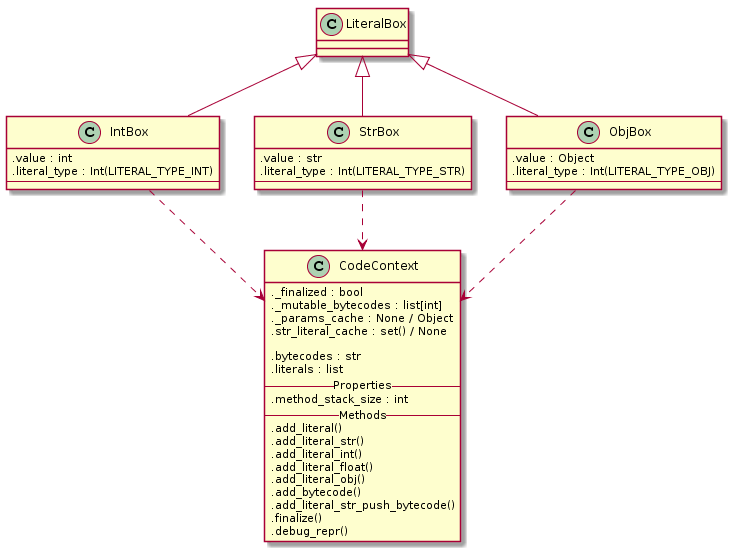

# Jak se píše programovací jazyk 5: Bajtkód a literály

2019/04/18

Lexer rozděluje vstupní text na tokeny, které jsou parserem transformovány na abstraktní syntaktické stromy. Ty by měl vzít kompilátor a udělat z nich bytecode. Předtím je ovšem nutné si důkladně rozmyslet, jak má vlastně výsledný bytekód vypadat, a tedy hlavně jak má vypadat virtuální stroj, kterým bude interpretován.

Jak už jsem zmiňoval, nejsem ani v nejmenším odborník na tvorbu programovacích jazyků. Když jsem se pustil do psaní specifikace VM, byly mi známé následující přístupy:

1. Interpretace AST
2. Interpretace imperativního bytekódu
3. Interpretace *stack based* bytekódu

Pavel Křivánek ve své bakalářské práci [Podpora beztřídního programování ve Squeak Smalltalku](http://kitakitsune.org/ltas/resources/Podpora_beztridniho_programovani_ve_Squeak_Smalltalku.pdf) použil pro svůj Selfem inspirovaný jazyk Marvin *stack based* (na zásobníku založený) bytekód ve stylu forthu.

Oproti tomu [The Design and Implementation of the Self Compiler, an Optimizing Compiler for Object-Oriented Programming Languages](https://pdfs.semanticscholar.org/7a9f/b345d1372f99c47f68fbcf5187f10af87704.pdf) (dále jen *DISCOCOOPL*) zmiňuje spíše imperativní bytekód ve stylu assembleru.

V krátké výměně mailů, které jsem Pavlovi Křivánkovi poslal, zmiňoval, abych zkusil zkombinovat první a druhý přístup.

Dále zde byly dva projekty *Smalltalků* napsaných v RPythonu:

1. [https://github.com/SOM-st/RPySOM](https://github.com/SOM-st/RPySOM)
2. [https://github.com/hpi-swa/RSqueak](https://github.com/hpi-swa/RSqueak) (viz paper [How to Build a High-Performance VM for Squeak/Smalltalk in Your Spare Time](https://www.hpi.uni-potsdam.de/hirschfeld/publications/media/FelgentreffPapeReinHirschfeld_2016_HowToBuildAHighPerformanceVmForSqueakSmalltalkInYourSpareTimeAnExperienceReportOfUsingTheRPythonToolchain_AcmDL.pdf))

Oba dva sloužily jako lehká technická inpisrace při tvorbě interpretru.

## Souslednost

Za zmínku pravděpodobně stojí, že tato a následující dvě kapitoly byly psány až po dokončení většiny práce na bajtkódech, interpreteru a kompilátoru. Práce na těchto komponentách však probíhala zároveň a jednalo se do jisté míry o iterativní proces. Člověk přidá jeden parametr bajtkódu, upraví kompilátor a interpreter a hned vidí, že to ovlivnilo celkový obraz tak, že nyní není třeba kousek tady a je třeba přidat kousek támhle, což vede ke změnám v kompilátoru tady a támhle, díky čemuž není třeba v interpretru tohle a támhleto může fungovat jinak..

Vytvářet něco, kde se zároveň tři a více komponent ovlivňuje a bez samotné implementace se dopředu těžko představuje, jak konkrétně by to mělo celé vypadat, je zajímavá zkušenost. Nyní při psaní zpětně vidím, jak se to celé podepsalo na celkové podobě interpretru a hned mě napadá, že by šlo upravit spoustu komponent trochu jinak.

Vývoj, a zde a v následujících kapitolách popsaná podoba, byla ovšem diktována snahou o co nejrychlejší bootstrapping, s tím že na optimalizace a úpravy bude dost času později, pokud projekt vyhodnotím jako hodný dalšího pokračování.

## Literály

Bajtkód se neskládá pouze z jednotlivých instrukcí, skládá se také z tabulky literálů. V té jsou uloženy všechny konstantní hodnoty známé v době kompilace.

Mezi ně patří:

- Řetězce
- Čísla
- Nil
- Object
- Block
- Assignment primitive

Když pak interpreter dojde na část kde je nutné použít nějaký literál, nemusí ho v tu chvíli rekonstruovat z bajtkódu, místo toho se jednoduše podívá do tabulky literálů na patřičný index a vytvoří podle něj objekt.

## Bytecodes

Pavel Křivánek navrhoval pro Marvina následující bytekódy:

- **send:** Zašle objektu na vrcholu zásobníku zprávu identifikovanou určitým selektorem.
- **selfSend:** Zašle příjemci zprávu identifikovanou určitým selektorem.
- **resend:** Zašle příjemci zprávu identifikovanou určitým selektorem v kontextu předka.
- **pushSelf** Na vrchol zásobníku umístí příjemce zprávy.
- **pushLiteral:** Na vrchol zásobníku umístí referenci na určený literál.
- **pop** Odebere jednu položku z vrcholu zásobnı́ku a získanou hodnotu zahodı́.
- **returnTop** Návrat z metody s vrcholem zásobnı́ku jako výsledkem.
- **returnImplicit** Implicitní návrat z kontextu.

Osobně jsem se tímto setem hodně inspiroval, nakonec jsem však pro některé nenašel použití a naopak, některé které v Marvinovi nebyly mi tam přišly jako užitečné.

Nakonec jsem skončil s následujícím setem:

- SEND
- PUSH_SELF
- PUSH_LITERAL
- ADD_SLOT
- RETURN_TOP
- RETURN_IMPLICIT

Přičemž některé z nich jsou parametrizované a můžou tak zabrat až tři bajty. Instrukce pracují se zásobníkem, na který vkládají, či z něj odebírají hodnoty. Zásobník je tvořen zvlášť pro každou metodu, proto například chybí instrukce pro odstranění hodnot ze zásobníku - vzhledem k tomu že instrukce hodnoty ze zásobníku odebírají implicitně, na konci se prostě celý zásobník zahodí, někdy s tím, že hodnota na vrcholu je vložená na vrchol zásobníku, ze kterého vznikl tento.

Musím říct, že mě docela překvapilo, jak málo instrukcí mi stačilo. Intuitivně jsem čekal, že jich bude minimálně dvacet. Že by mi jich stačilo šest, respektive pět bez `ADD_SLOT`, která je tam jen protože je to častá operace, to mě ani ve snu nenapadlo.

### PUSH_LITERAL

Instrukce, kterou začíná prakticky každý set bajtkódů. Jako první vezmeme něco z tabulky literálů a vložíme to na stack.

Instrukce má dva parametry:

1. `literal_type`
2. `literal_index`

Druhý určuje index v tabulce, první pak typ literálů, kterým v současnosti můžou být:

1. `Nil`
2. `Int`
3. `String`
4. `Object`
5. `Block`
6. `Assignment primitive`

Detaily fungování budou vysvětleny v kapitole o interpretru.

Délka instrukce: 3 batkódy.

### PUSH_SELF

Na vrchol zásobníku vlož *self*, tedy objekt v jehož kontextu aktuálně probíhá kód.

Délka instrukce: 1 bajtkód.

### ADD_SLOT

Z vrcholu zásobníku seber jeden objekt jako *hodnotu*, druhý objekt jako *jméno* a třetí objekt jako *příjemce*. Do *příjemce* potom ulož *hodnotu* na dané *jméno*. Výsledný objekt vlož na vrchol zásobníku.

Tato instrukce by nemusela existovat, šlo by to celé implementovat pomocí *mirrorů*, ale vzhledem k tomu o jak často používanou záležitost se jedná, a jak strašně moc to zjednodušuje zbytek kódu, rozhodl jsem se jí takhle použít.

Délka instrukce: 1 bajtkód.

### RETURN_TOP

Z vrcholu zásobníku vyber hodnotu a vrať jí.

Vrácení probíhá tak, že pokud jsou v tomto procesu předchozí zásobníky, vlož jí na vrchol předchozího zásobníku. Pokud ne, ulož jí jako návratovou hodnotu procesu.

Délka instrukce: 1 bajtkód.

### RETURN_IMPLICIT

Docela dlouho jsem přemýšlel k čemu byla Pavlovi `returnImplicit`, došlo mi to až když jsem implementoval bloky.

Z vrcholu zásobníku vyber hodnotu a vrať jí skrz tolik framů, dokud nebudeš ve scope ke kterému se return vztahuje.

Tohle je Selfová specialita, kde return z bloku nevrací jen z bloku, ale ze scope, kde je blok použit.

Tedy kód

    (|| something ifTrue: [^ something].)

vrací nejen z bloku, ale i z method-objectu kolem něj.

Délka instrukce 1 bajtkód.

### SEND

Nejkomplexnější instrukce, která objektu na zásobníku pošle zprávu.

Instrukce má dva parametry:

1. `message_type`
2. `number_of_parameters`

Akt poslání zprávy probíhá tak, že ze zásobníku je nejdříve vybráno `number_of_parameters` objektů do pole parametrů. V případě, že `message_type` je jeden z resend typů (`UNARY_RESEND` či `KEYWORD_RESEND`, je navíc ještě z vrcholu zásobníku sebráno jméno rodiče, kterému se má zpráva přeposlat. Dále je z vrcholu zásobníku sebráno jméno zprávy (*selector*) a objekt, kterému bude zpráva poslána.

Pokud jde o resend, je zpráva přeposlána parentovi - slot je vyhledán v patřičném rodičovi a je vrácen či vykonán v současném kontextu.

Pokud jde o kód, je vykonán tak, že je vytvořen nový zásobník, uložen nulový ukazatel na bajtkód (program counter) a objektu je přimapován do `.scope_parent` současný kontext.

Pokud jde o primitivní kód, je vykonán. Primitivní kód je voláním kompilovaných částí psaných v RPythonu.

Pokud jde o hodnotu, je vložena na vrchol zásobníku.

SEND je nejsložitější instrukcí, kterou možná časem rozdělím na víc menších.

Délka instrukce: 3 batkódy.

### Budoucí rozvoj

Bytecode je od slova *byte*. Samozřejmě nemusí mít přesně jeden bajt, ostatně moje instrukční sada by se mohla vejít do čtyř bitů. Do budoucna by ale mohlo interpreter zrychlit, kdybych provedl rozvoj všech často používaných instrukcí a převedl je z několika bajtových parametrizovaných na jedno-bajtovové. Například bych mohl zavést bytekód pro `SELF_SEND`, který by zkombinoval funkcionalitu `PUSH_SELF` a `SEND`. Nebo `SENDKW1`, který automaticky vybere jeden parametr ze zásobníku a bere ho jako *keyword message*. Některé instrukce by mohly obcházet `PUSH_LITERAL` bajtkód a rovnou si sahat na index do tabulky literálů. A tak podobně.

Taky limitace parametrů na jeden bajtkód momentálně znamená, že je možné použít pouze 256 literálů v jedné metodě, což ovšem v současné fázi vývoje bohatě stačí a nemá smysl to řešit. Časem chci přidat rozvoj na minimálně dvoubajtové definice, takže PUSH_LITERAL se prodlouží.

Zatím se však budu držet současné podoby, jelikož mám větší problémy k vyřešení a jak pravil klasik, předčasná optimalizace je kořenem všeho zla.

## CodeContext

Stojí za zmínku se podívat, v čem a jak jsou vlastně bajtkódy i literály ukládány. Jedná se o třídu `CodeContext`, která obsahuje string s bajtkódy. Řešil jsem na #pypy v čem je nejlepší uchovávat bajtkódy, protože sám bych měl asi tendence použít bytearray, ale ten jednak po rpythonem funguje divně (měl jsem s tím nějaké problémy, už nevím přesně jaké), ale hlavně je pomalejší než zpracování stringů.

Dále obsahuje pole `literals` s tabulkou literálů, z nihž každý je zabalen v nějakém boxu (viz omezení RPythonu na jeden datový typ polí).

Pak jsou zde ještě dočasně uloženy různé speciální hodnoty, například se tu cacheují dočasné mezi-objekty, které uchovávají parametry.

## Zásobníky

Zasobníky jsem implementoval jako hierarchickou strukturu tří tříd;

### MethodStack

Třída MethodStack tvoří prostý zásobník, na jehož vrcho je možné vložit instanci Objektu metodou `.push()`, sundat z vrcholu Objekt metodou `.pop()` a jako bonus implementuje `.pop_or_nil()`, která v případě že je zásobník prázdný vrátí singleton Objektu `nil`.

Třída dále uchovává nějaké obecné properties, jako `.error_handler`, `.code_context`, `.bc_index` a `.self`. Error handler je použit k řešení výjimek, code_context uchovává bajtkǒdy a bc_index slouží jako program counter.

Při běhu metody se sem ukládají jednotlivé literály a postupně si je z toho tahají instrukce tak jak jdou za sebou. V případě že je volána další metoda, tak na vrchol zásobníku se vloží výsledek poté co skončí. To řeší následující třída metodou `.pop_frame_down()`.

Momentálně jsou k dispozici dvě implementace, jedna jako před-alokované pole, která je trochu rychlejší v kódu bez JITu a druhá jako linked-list, která je trochu rychlejší s JITem.

### ProcessStack

Na tuto třídu navazuje `ProcessStack`, který je zásobníkem zásobníků a v podstatě reprezentuje jeden běžící proces. Pokaždé, když je vykonáván nějaký `Object` s kódem, je v ní vytvořen nový zásobník. Když kód doběhne, tak vezme poslední hodnotu z posledního zásobníku a vloží jí na vrchol zásobníku předtím. Ten co je na vrchu pak zahodí (proto nejsou potřeba samostatné `POP` bajtkódy).

Jak už napovídá název, taky uchovává další kontext „procesu“, jako výsledek běhu programu, informaci o tom jestli proces ještě stále běží, nebo ne.

Za zmínku stojí, že aktuální frame navrchu je vždy uchováván v proměnné `.frame`.

### ProcessCycler

Poslední třídou je `ProcessCycler`, který přepíná aktuálně prováděný proces tím, že ho vždy uloží do proměnné `.process`. Vzhledem k tomu, že smyčka interpreteru vždy načte tuto hodnotu, provede jeden bajtkód a zavolá cyklování procesu, je tím docíleno jednoduché paralelizace.

## Pokračování

V dalším díle se podíváme na implementace kompilátoru do výše uvedeného bajtkódu. Ačkoliv jsem intuitivně čekal, že půjde o něco složitého, nakonec se to ukázalo jako jedna z nejjednodušších věcí na celém projektu.